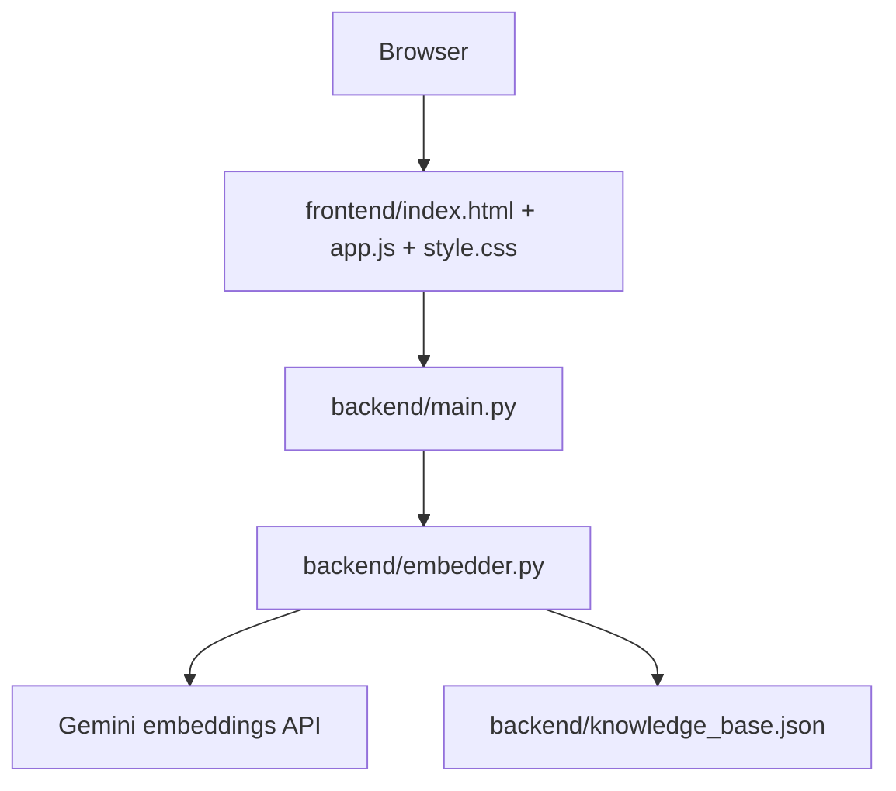

# Project Summary
RFP Match is a PeopleOS proof-of-concept that retrieves answers from a static 30-entry knowledge base using Gemini embeddings and cosine similarity. The product returns the top 3 matches with confidence labels and a separate staleness warning.

# Technology Stack
- Python
- FastAPI
- Uvicorn
- Google Generative AI SDK
- NumPy
- python-dotenv
- Vanilla HTML/CSS/JavaScript
- Firebase Hosting for the static frontend

# Architecture
The application is split into a static frontend and a Python backend.

The backend loads and caches knowledge base answer embeddings at startup. Each request embeds only the user question, compares it against cached answer vectors, and returns the top 3 results.

# Repository Structure
- `backend/main.py`: FastAPI app, `/health`, `/match`, startup initialization
- `backend/embedder.py`: Gemini model lookup, embedding cache, cosine similarity, tiering, stale flag
- `backend/knowledge_base.json`: 30 static PeopleOS answers
- `backend/update_kb_dates.py`: maintenance script that rewrites dates in the KB file
- `backend/tests/`: executable live-backend diagnostics and the labeled eval set
- `frontend/index.html`: single-page UI
- `frontend/app.js`: fetch logic and result rendering
- `frontend/style.css`: all layout and styling
- `firebase.json`: Firebase Hosting rewrite for the frontend
- `.firebaserc`: Firebase project mapping
- `docs/`: architecture and analysis notes

# Implemented Features
- Question submission through a single textarea
- Semantic retrieval over a static KB
- Top-3 ranking with similarity scores
- Confidence tiers: High, Medium, Low
- Decision labels: Auto-Answer, Review Required, Escalate to SME
- Staleness flag from `review_due`
- Loading spinner and disabled submit state
- Empty state and error state in the results panel
- Temporary “Mark as Used” UI feedback
- Firebase Hosting configuration for the static frontend

# API Overview
- `GET /health` returns `{"status":"ok"}`
- `POST /match` accepts `{"question":"..."}` and returns `query` plus a `results` array of ranked matches

# Data Flow
1. User submits a question in the browser.
2. `frontend/app.js` POSTs the question to `/match`.
3. `backend/main.py` validates the input and calls `RFMEmbedder.find_matches`.
4. `backend/embedder.py` embeds the query with Gemini.
5. The query vector is compared to cached answer embeddings.
6. Results are sorted and labeled.
7. The frontend renders cards and the stale warning if needed.

# AI Pipeline
- Gemini embedding model is resolved dynamically from a short fallback list.
- Knowledge base answers are embedded once at startup.
- Query embedding happens per request.
- Cosine similarity drives ranking.
- Hard-coded score thresholds drive the confidence tier.
- `review_due` is checked independently of similarity.

# Current Limitations
- No auth or authorization
- No database
- No persistence for user actions
- No PDF ingestion
- No feedback loop
- No production backend deployment config in the repository
- No frontend build system
- Hard-coded local backend URL in `frontend/app.js`
- No assertion-based unit test suite
- Open CORS on the backend

# Known Bugs
- Category badge class derivation in `frontend/app.js` does not match the CSS selectors, so category colors do not map correctly.
- The frontend shows a generic connection error for all fetch failures, including server-side validation failures.
- If backend startup fails, the server still runs with `embedder = None` and `/match` returns 503.

# Missing Work
- Authentication
- Authorization
- Persistent usage logging for “Mark as Used”
- PDF/document ingestion
- Backend deployment pipeline
- Frontend/backend environment abstraction for the API URL
- Formal automated tests

# Current Status
This is a working prototype of the retrieval core and the static UI. The backend is deployed on Render at `https://peopleos-rfp-response-assistant.onrender.com`. It is not production-ready.

# Key Files
- `backend/main.py`
- `backend/embedder.py`
- `backend/knowledge_base.json`
- `frontend/index.html`
- `frontend/app.js`
- `frontend/style.css`
- `backend/tests/run_evals.py`
- `backend/tests/eval_set.json`
- `firebase.json`

# Critical Implementation Notes
- The only required environment variable is `GEMINI_API_KEY`.
- The backend caches answer embeddings in memory on startup.
- The frontend API URL is configured to target `https://peopleos-rfp-response-assistant.onrender.com/match`.
- Firebase Hosting serves only the frontend folder.
- The repository does not contain a backend deployment manifest.
