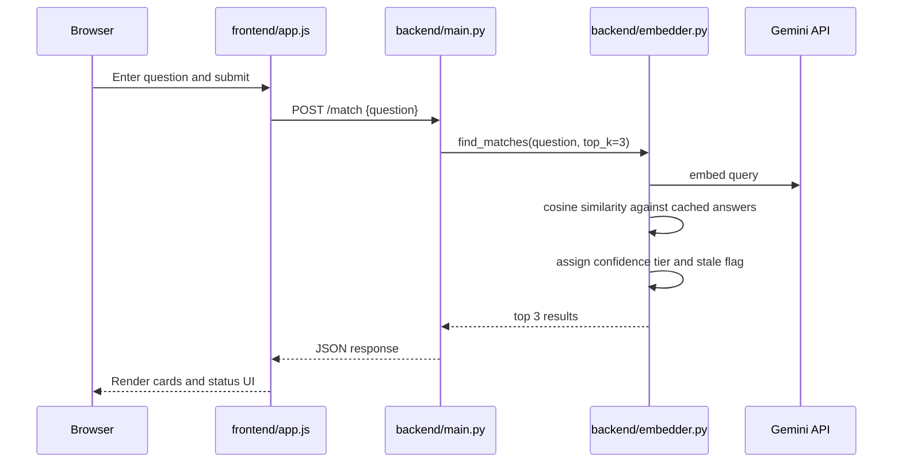

# 1. Project Overview

## Purpose
RFP Match is a proof-of-concept retrieval tool for the fictional PeopleOS HR Tech SaaS company. It helps a user paste an RFP question, searches a static knowledge base of 30 pre-written answers, and returns the top semantic matches with a confidence label and a staleness flag.

## Current State
The repository contains a working FastAPI backend, a static HTML/CSS/JavaScript frontend, Firebase Hosting configuration for the frontend, a static knowledge base, a date maintenance script, and a set of executable evaluation scripts. There is no database, no authentication, no backend deployment manifest, and no feedback loop that persists user actions.

## Problem Solved
The implemented system solves narrow semantic retrieval for repeatable RFP questions. It does not generate answers from scratch. It retrieves existing PeopleOS answers and surfaces an explicit decision label so a user can decide whether to auto-use, review, or escalate.

## Scope
The codebase implements only the following scope:
- Static PeopleOS knowledge base retrieval
- Confidence-tiered similarity ranking
- Staleness warning based on `review_due`
- Single-page frontend interaction
- Firebase Hosting for static frontend delivery
- Evaluation and diagnostic scripts for the backend

It does not implement PDF ingestion, account management, approval workflows, persistence, multi-tenant isolation, or production backend deployment.

## Repository Summary
The repository is organized into three working areas:
- `backend/`: FastAPI app, Gemini embedding logic, static knowledge base, maintenance script, and executable evaluation scripts
- `frontend/`: one-page UI and client-side fetch logic
- `docs/`: design notes, edge-case analysis, implementation plan, and problem statement

The root also contains Firebase configuration files and a README.

# 2. Technology Stack

## Languages
- Python for backend and scripts
- HTML for structure
- CSS for styling
- JavaScript for browser behavior

## Frameworks
- FastAPI for the HTTP backend
- Uvicorn as the ASGI server

## Libraries
- `google-generativeai` for Gemini model discovery and embedding calls
- `numpy` for vector math and cosine similarity
- `python-dotenv` for local environment loading
- `fastapi` and `pydantic` via FastAPI request modeling

## APIs
- Google Gemini embeddings API through the Google Generative AI SDK
- FastAPI REST endpoints

## Embedding Models
The backend code dynamically checks for these Gemini embedding model names in this order:
- `models/text-embedding-004`
- `models/gemini-embedding-2`
- `models/gemini-embedding-001`

The selected model name is stored on the embedder instance. The repository does not contain a local model file.

## LLMs
No chat or generation LLM is implemented. The AI use is embedding-only.

## Firebase
Firebase Hosting is configured for the `frontend/` folder only.

## Build Tools
There is no frontend build tool or JavaScript package manager in the repository. There is no `package.json`.

## Dependencies
The Python backend dependencies are listed in `backend/requirements.txt`.

# 3. Repository Structure

## Complete Tree
```text
RFPProject/
├── README.md
├── firebase.json
├── .firebaserc
├── .gitignore
├── CODEBASE_CONTEXT.md
├── AI_HANDOFF.md
├── ENGINEERING_REFERENCE.md
├── backend/
│   ├── .env.template
│   ├── embedder.py
│   ├── knowledge_base.json
│   ├── main.py
│   ├── requirements.txt
│   ├── update_kb_dates.py
│   └── tests/
│       ├── eval_set.json
│       ├── run_evals.py
│       ├── test_backend.py
│       ├── test_distribution.py
│       ├── test_mismatched.py
│       └── test_staleness.py
├── docs/
│   ├── architecture.md
│   ├── edgecase.md
│   ├── phaseWiseImplementationPlan.md
│   └── problemstatement.txt
└── frontend/
    ├── app.js
    ├── index.html
    └── style.css
```

## Purpose of Each Folder
- `backend/`: server-side matching logic, data, scripts, and live evaluation harnesses
- `backend/tests/`: executable scripts and the labeled evaluation set used to exercise the live backend
- `frontend/`: static browser UI with no framework or build pipeline
- `docs/`: narrative documentation that explains the prototype, thresholding, edge cases, and intended build plan

## Purpose of Important Files
- `README.md`: high-level project pitch, local run instructions, and a summary of the confidence-threshold rationale
- `firebase.json`: Firebase Hosting configuration that serves `frontend/` and rewrites routes to `index.html`
- `.firebaserc`: Firebase project mapping
- `.gitignore`: ignores environment files, documentation folder paths, Python caches, and virtual environments
- `backend/main.py`: FastAPI application entrypoint
- `backend/embedder.py`: embedding and similarity engine
- `backend/knowledge_base.json`: static 30-entry PeopleOS knowledge base
- `backend/update_kb_dates.py`: maintenance utility that rewrites `last_updated` and `review_due`
- `frontend/index.html`: single-page UI markup
- `frontend/app.js`: client-side request handling and result rendering
- `frontend/style.css`: all presentation and responsive rules
- `backend/tests/eval_set.json`: 50 labeled evaluation cases
- `backend/tests/run_evals.py`: live evaluation scorecard runner
- `backend/tests/test_backend.py`: simple live backend smoke script
- `backend/tests/test_distribution.py`: similarity distribution diagnostic
- `backend/tests/test_mismatched.py`: unrelated and cross-over query diagnostic
- `backend/tests/test_staleness.py`: staleness logic diagnostic

## Generated or Ignorable Files
- `.firebase/hosting.ZnJvbnRlbmQ.cache` is a generated Firebase Hosting cache artifact
- `.git/` is repository metadata, not application source

# 4. Application Startup

## Frontend Startup
The browser entrypoint is `frontend/index.html`.

The page loads:
- Google Fonts `Inter`
- `frontend/style.css`
- `frontend/app.js`

The page is a single static document with no client-side router.

## Backend Startup
The backend entrypoint is `backend/main.py`.

Startup behavior:
- `load_dotenv()` is called before importing the embedder class
- A global `FastAPI` app is created
- CORS middleware is added with permissive settings
- On FastAPI startup, the app resolves `backend/knowledge_base.json` and instantiates `RFMEmbedder`
- `RFMEmbedder` loads the knowledge base and precomputes embeddings for every answer

If embedder initialization fails, the exception is logged and the server remains alive with `embedder = None`. The first request then fails with HTTP 503.

## Initialization
Initialization is eager for the knowledge base embeddings and lazy for query handling.

The request path only embeds the incoming query at call time. The knowledge base answer embeddings are cached in memory during startup.

## Configuration Loading
The only explicit runtime environment variable in code is `GEMINI_API_KEY`.

- `backend/main.py` loads environment variables via `python-dotenv`
- `backend/embedder.py` reads `GEMINI_API_KEY` from the environment and raises if it is missing
- `backend/tests/*.py` also load `.env` from the backend directory before constructing the embedder

There is no checked-in `.env` file. Only `backend/.env.template` exists.

# 5. Architecture

## Frontend Architecture
The frontend is a single-page, DOM-driven application with the following areas:
- A header bar with branding
- A left panel for query input and category reference chips
- A right panel for empty state, errors, result cards, and the prototype note

There is no framework state store. The UI state is maintained through DOM references and class toggles.

## Backend Architecture
The backend has two runtime layers:
- `main.py`: HTTP surface and request validation
- `embedder.py`: similarity engine, Gemini calls, confidence logic, and staleness logic

The embedding engine loads data once and then answers requests using in-memory arrays.

## API Architecture
There are two documented endpoints:
- `GET /health`
- `POST /match`

Both are implemented in `backend/main.py`.

## Knowledge Base Architecture
The knowledge base is a static JSON array of 30 objects. Each object has:
- `id`
- `category`
- `question`
- `answer`
- `last_updated`
- `review_due`
- `owner`

The file is treated as the source of truth for matching answers and ownership metadata.

### Knowledge Base Inventory
The current file contains these 30 entries:

| ID | Category | Question Topic | Owner |
|---|---|---|---|
| KB001 | Security & Compliance | SOC 2 Type II certification | Security Team |
| KB002 | Security & Compliance | GDPR compliance and data residency | Legal & Compliance |
| KB003 | Security & Compliance | Encryption standards | Security Team |
| KB004 | Security & Compliance | Single Sign-On support | Engineering |
| KB005 | Security & Compliance | Penetration testing policy | Security Team |
| KB006 | Security & Compliance | CCPA / CPRA compliance | Legal & Compliance |
| KB007 | Integrations & APIs | Payroll integrations | Partnerships |
| KB008 | Integrations & APIs | Open API availability | Engineering |
| KB009 | Integrations & APIs | Slack and Microsoft Teams integration | Product |
| KB010 | Integrations & APIs | Workday and SAP SuccessFactors integration | Solutions Engineering |
| KB011 | Integrations & APIs | Bulk data import formats | Engineering |
| KB012 | Implementation & Onboarding | Enterprise implementation timeline | Customer Success |
| KB013 | Implementation & Onboarding | Dedicated implementation support | Customer Success |
| KB014 | Implementation & Onboarding | Training resources | Customer Success |
| KB015 | Implementation & Onboarding | Data migration process | Solutions Engineering |
| KB016 | Implementation & Onboarding | Phased rollout support | Customer Success |
| KB017 | Pricing & Licensing | Pricing model | Sales |
| KB018 | Pricing & Licensing | Implementation fees | Sales |
| KB019 | Pricing & Licensing | Free trial or pilot program | Sales |
| KB020 | Pricing & Licensing | Minimum contract length | Sales |
| KB021 | SLAs & Support | Uptime SLA | Engineering |
| KB022 | SLAs & Support | Support tiers | Customer Success |
| KB023 | SLAs & Support | Critical incident response | Engineering |
| KB024 | SLAs & Support | Disaster recovery plan | Engineering |
| KB025 | SLAs & Support | Data backup frequency | Engineering |
| KB026 | Customer References & Case Studies | Retail sector references | Sales |
| KB027 | Customer References & Case Studies | Healthcare industry experience | Sales |
| KB028 | Customer References & Case Studies | Measurable customer outcomes | Marketing |
| KB029 | Customer References & Case Studies | Total customer count and size | Sales |
| KB030 | Customer References & Case Studies | Public case studies | Marketing |

## Embedding Pipeline
The implemented embedding pipeline is:
1. Load all knowledge base rows
2. Extract every `answer`
3. Resolve an available Gemini embedding model
4. Embed all answers using `task_type="retrieval_document"`
5. Cache the resulting vectors in memory
6. At query time, embed the question using `task_type="retrieval_query"`
7. Compute cosine similarity against every cached answer vector
8. Sort descending and return the top 3

## Request Flow


## Response Flow
The backend returns the top matches sorted by similarity score. The frontend renders each match as a card with:
- rank
- category badge
- decision label badge
- matched question
- answer
- similarity score bar and percentage
- owner
- last updated date
- stale warning if applicable

## Deployment Architecture
Only the static frontend has Firebase Hosting configuration.

The repository includes a Render deployment blueprint in `render.yaml`, and the backend is deployed at `https://peopleos-rfp-response-assistant.onrender.com`.

Firebase hosting rewrites all routes to `frontend/index.html`, which is suitable for a static single-page application.

# 6. Feature Inventory

| Feature | Purpose | Files | Functions / Code Paths | Limitations |
|---|---|---|---|---|
| Query submission | Accept a user’s RFP question | `frontend/index.html`, `frontend/app.js` | Form submit handler in `app.js` | Only one text field; no file upload or PDF parsing |
| Semantic retrieval | Match a query to existing answers | `backend/main.py`, `backend/embedder.py` | `match_rfp`, `RFMEmbedder.find_matches` | Depends on Gemini availability and API key |
| Startup embedding cache | Avoid re-embedding answers on every request | `backend/embedder.py`, `backend/main.py` | `RFMEmbedder.__init__`, `load_and_cache_kb` | Startup cost is paid every time the server starts |
| Confidence tiering | Translate similarity into actionable labels | `backend/embedder.py` | Hard-coded thresholds in `find_matches` | Thresholds are fixed in code and not configurable |
| Staleness warning | Warn when an answer is past review date | `backend/embedder.py`, `frontend/app.js` | `is_stale` flag and warning block | Malformed dates are treated as stale; the warning is date-based only |
| Result rendering | Show top 3 ranked matches | `frontend/app.js`, `frontend/style.css` | `renderResults` | Uses innerHTML insertion; no pagination or search refinement |
| Loading and error states | Prevent ambiguous UI during network calls | `frontend/app.js`, `frontend/index.html`, `frontend/style.css` | Spinner, empty state, error state toggles | Error copy is generic even when the server returns a validation error |
| Mark as Used affordance | Simulate a future usage-log action | `frontend/app.js` | Local button state toggle only | No backend persistence or analytics |
| Firebase Hosting | Serve the static frontend | `firebase.json`, `.firebaserc` | Hosting rewrite configuration | Backend is not hosted by Firebase in this repo |
| Evaluation scripts | Exercise the live backend with labeled examples | `backend/tests/*.py`, `backend/tests/eval_set.json` | Script entry points | These are diagnostic scripts, not assertion-based unit tests |

# 7. Frontend

## Pages
There is one page only: `frontend/index.html`.

## Components
The UI is composed of these visible regions:
- Header bar
- Left input panel
- Right results panel
- Empty state
- Error state
- Match card list
- Prototype information box

There are no React/Vue/Svelte components.

## HTML
`frontend/index.html` defines:
- A header with the PeopleOS logo text and subtitle
- A textarea for the question
- A submit button
- Category reference chips for the six KB categories
- A results container with hidden empty/error/match/info sections

## CSS
`frontend/style.css` defines the entire visual system:
- CSS variables for palette, decisions, borders, shadows, and radii
- A two-column desktop layout
- A stacked mobile layout at the 900px breakpoint
- Badge colors for categories and decision states
- Spinner animation
- Result card animation
- Stale warning styling
- Button hover/disabled/used states

## JavaScript
`frontend/app.js` performs all runtime browser logic:
- Binds to DOMContentLoaded
- Handles form submission
- Sends `POST https://peopleos-rfp-response-assistant.onrender.com/match`
- Disables the submit button and shows a spinner during fetch
- Renders returned matches into cards
- Shows the stale warning block when `is_stale` is true
- Toggles a temporary local confirmation state for “Mark as Used”

## State
The script keeps state in the DOM rather than in an application store. The key runtime elements are:
- question input
- submit button
- spinner
- empty state
- error state
- match list
- info box

## Events
Implemented events:
- Form submit
- Per-card “Mark as Used” click

## API Integration
The frontend sends JSON in the shape `{"question": "..."}` to the backend `/match` endpoint.

The API URL is configured in `frontend/config.js` and currently points to `https://peopleos-rfp-response-assistant.onrender.com/match`.

## Loading
While awaiting a response the frontend:
- Disables the submit button
- Replaces the button label with “Finding Matches...”
- Shows the spinner
- Keeps previous match cards visible until the new response arrives

## Errors
If the request fails, the code hides the current matches and prototype info box and shows a generic connection error message.

The catch path does not differentiate between network failures and server validation failures. That behavior is current implementation, not an inferred intention.

## Responsive Behavior
At widths under 900px the two panels stack vertically and the result-card metadata grid collapses to one column.

## Unused Code
No unused JavaScript modules exist. The only interactive affordance that does not persist anywhere is the “Mark as Used” button, which is intentionally local-only in this prototype.

## Dead Code
No unreachable code blocks are visible in the frontend source. The category badge class derivation, however, is not aligned with the CSS class names and therefore does not produce the intended category-specific badge colors.

## Important Frontend Bug Evidence
`frontend/app.js` derives the category class with `match.category.toLowerCase().replace(/[^a-z0-t]/g, "")`. This produces strings such as `securitycompliance` and `integrationsapis`, while the stylesheet expects classes like `security`, `integrations`, `implementation`, `pricing`, `slas`, and `references`. The category badge colors therefore do not line up with the implemented CSS selectors.

# 8. Backend

## Every File

### `backend/main.py`
FastAPI app entrypoint.

Implemented items:
- `app = FastAPI(title="RFP Match Backend POC")`
- permissive CORS middleware
- global `embedder` variable
- `MatchRequest` Pydantic model with a single `question` field
- startup event that loads the knowledge base and instantiates `RFMEmbedder`
- `GET /health`
- `POST /match`

Behavior:
- Empty or whitespace-only questions return HTTP 400
- If the embedder failed to initialize, requests return HTTP 503
- Any matching exception is wrapped in HTTP 500 with a similarity matching error message

### `backend/embedder.py`
Core retrieval engine.

Implemented items:
- Reads `GEMINI_API_KEY` from the environment
- Configures the Gemini SDK
- Attempts to discover a usable embedding model from the Gemini model list
- Loads `knowledge_base.json`
- Embeds all answers once at startup and caches them in memory
- Computes cosine similarity with NumPy
- Assigns confidence tiers and decision labels
- Computes a stale flag from `review_due`
- Returns the top `k` matches sorted by similarity score

### `backend/knowledge_base.json`
Static PeopleOS knowledge base with 30 records.

### `backend/update_kb_dates.py`
Maintenance script that rewrites dates in the knowledge base file.

### `backend/requirements.txt`
Python dependency list.

## Every Module
- `main.py`: HTTP layer, validation layer, startup orchestration
- `embedder.py`: AI retrieval layer and scoring logic
- `update_kb_dates.py`: offline data mutation helper

## Every Class
- `RFMEmbedder` in `embedder.py`
- `MatchRequest` in `main.py`

## Every Function

### `backend/main.py`
- `startup_event()`
  - Builds the knowledge base path
  - Instantiates `RFMEmbedder`
  - Leaves the server running even if initialization fails
- `health_check()`
  - Returns `{"status": "ok"}`
- `match_rfp(request)`
  - Validates that the request has a non-empty question
  - Calls `embedder.find_matches(query, top_k=3)`
  - Returns the original question text and the results list

### `backend/embedder.py`
- `RFMEmbedder.__init__(kb_path)`
  - Validates `GEMINI_API_KEY`
  - Configures the Gemini client
  - Resolves an embedding model name
  - Calls `load_and_cache_kb()`
- `load_and_cache_kb()`
  - Reads the JSON knowledge base
  - Extracts every answer
  - Embeds the answers as a batch with `task_type="retrieval_document"`
  - Stores cached vectors as NumPy arrays
- `compute_similarity(query_vector, target_vector)`
  - Calculates cosine similarity
  - Returns `0.0` when either vector has zero norm
- `find_matches(query, top_k=3)`
  - Embeds the query with `task_type="retrieval_query"`
  - Scores every cached answer
  - Assigns confidence tier, decision label, decision color, and staleness flag
  - Sorts by similarity score descending
  - Adds a `rank` field to the top results

### `backend/update_kb_dates.py`
- `shift_kb_dates()`
  - Reads `knowledge_base.json`
  - Uses a hard-coded anchor date of `2026-06-30`
  - Rewrites the first 12 entries to be stale and the remaining 18 to be non-stale relative to that anchor
  - Sets `last_updated` to approximately 182 days before the new `review_due`
  - Writes the file back in place

## Every Endpoint
- `GET /health`
- `POST /match`

## Validation
Implemented validation is minimal:
- `main.py` checks that the `question` field is not empty after stripping whitespace
- `embedder.py` checks that `GEMINI_API_KEY` exists
- `load_and_cache_kb()` checks that the knowledge base file exists and is non-empty

There is no structural validation of every JSON object field before the cache is built. The code assumes the required keys exist when it later reads them.

## Business Logic
The business logic is a retrieval ranking pipeline:
- query embedding
- cosine similarity against cached answer embeddings
- fixed threshold mapping to confidence tiers
- independent date-based staleness classification

## Error Handling
Error handling exists at these layers:
- Missing `GEMINI_API_KEY` raises `ValueError`
- Missing KB file raises `FileNotFoundError`
- Empty KB raises `ValueError`
- Gemini embedding failures raise `RuntimeError`
- Startup failures are caught in `main.py` and logged
- Request failures inside `/match` become HTTP 500

The code does not contain retry logic, backoff, fallback to another provider, or cached offline embeddings.

## Important Backend Bug Evidence
The knowledge base is assumed to contain all required keys. If a record is missing `answer`, `question`, `id`, `category`, `last_updated`, `review_due`, or `owner`, the code can fail with a runtime exception when that entry is processed.

# 9. API Documentation

## `GET /health`
### Purpose
Basic service health check.

### Input
No body.

### Output
```json
{"status": "ok"}
```

### Errors
No explicit error handling is implemented.

### Example Request
```http
GET /health
```

### Example Response
```json
{"status": "ok"}
```

## `POST /match`
### Purpose
Match a user question against the PeopleOS knowledge base and return the top 3 ranked results.

### Input
```json
{"question": "string"}
```

### Output
The response shape is:
```json
{
  "query": "original question text",
  "results": [
    {
      "rank": 1,
      "id": "KB001",
      "category": "Security & Compliance",
      "matched_question": "...",
      "answer": "...",
      "last_updated": "YYYY-MM-DD",
      "review_due": "YYYY-MM-DD",
      "owner": "...",
      "similarity_score": 0.91,
      "confidence_tier": "High",
      "decision_label": "Auto-Answer",
      "decision_color": "green",
      "is_stale": false
    }
  ]
}
```

### Errors
- `400 Bad Request` when the question is empty or whitespace
- `503 Service Unavailable` when the embedder did not initialize
- `500 Internal Server Error` when matching fails

### Example Request
```http
POST /match
Content-Type: application/json

{"question":"Does PeopleOS support Single Sign-On?"}
```

### Example Response
```json
{
  "query": "Does PeopleOS support Single Sign-On?",
  "results": [
    {
      "rank": 1,
      "id": "KB004",
      "category": "Security & Compliance",
      "matched_question": "Does PeopleOS support Single Sign-On (SSO)?",
      "answer": "Yes. PeopleOS supports Single Sign-On (SSO) using SAML 2.0 and OAuth 2.0...",
      "last_updated": "2025-08-03",
      "review_due": "2026-02-01",
      "owner": "Engineering",
      "similarity_score": 0.9,
      "confidence_tier": "High",
      "decision_label": "Auto-Answer",
      "decision_color": "green",
      "is_stale": true
    }
  ]
}
```

# 10. Data Flow

## Complete Request Lifecycle
1. The user opens `frontend/index.html`.
2. The browser loads `frontend/style.css` and `frontend/app.js`.
3. The user submits a question in the textarea.
4. `app.js` disables the button and sends JSON to `POST /match`.
5. `main.py` validates the question and dispatches the request to the embedder.
6. `RFMEmbedder` embeds the query with Gemini.
7. The query vector is compared against the cached answer vectors.
8. Each match receives a similarity score, tier, decision label, decision color, and stale flag.
9. The backend returns the top 3 results.
10. The frontend renders cards and shows the prototype note.

## Data Shape Through the Pipeline
- Input: raw string question
- Internal embedding data: NumPy arrays
- Output: JSON objects with ranked metadata

# 11. AI Components

## Embedding Model
The AI component is the Gemini embeddings API accessed through the Google Generative AI SDK. The code does not include a local embedding model.

## Similarity Search
Similarity search is implemented as cosine similarity between the query vector and each cached knowledge base answer vector.

## Knowledge Base
The knowledge base is a static list of 30 curated PeopleOS answers stored in JSON.

## Prompt Construction
No prompt construction exists. The system does not generate prompts for a generative model.

## Confidence Calculation
Confidence is not learned. It is a hard-coded mapping from similarity score to tier:
- `>= 0.85`: High / Auto-Answer / green
- `0.60` to `0.84`: Medium / Review Required / amber
- `< 0.60`: Low / Escalate to SME / red

## Chunking
No chunking logic exists. The knowledge base entries are embedded as full answer strings.

## Other AI-Related Behavior
The backend performs a dynamic model-name lookup at startup. If model listing fails, it falls back to the default configured name.

# 12. Storage

## JSON
The project uses JSON for both persistent source data and evaluation data:
- `backend/knowledge_base.json`
- `backend/tests/eval_set.json`

## Files
All state is file-backed or in-memory. There is no database or object storage.

## Caching
The only runtime cache is the in-memory list of embedded answer vectors held by `RFMEmbedder`.

## Persistence
No user action is persisted.

## Knowledge Base
The knowledge base is static and checked into the repository.

## Temporary Files
The repository contains a generated Firebase cache file under `.firebase/`. No application-generated temporary file path is implemented in code.

## Knowledge Base Dates
`backend/update_kb_dates.py` mutates `backend/knowledge_base.json` in place. That script is maintenance-only and not part of request serving.

# 13. Configuration

## `.firebase`
Contains generated Firebase hosting cache artifacts. It is not application configuration.

## `firebase.json`
Hosting configuration:
- `public` is `frontend`
- hidden files and `node_modules` are ignored
- all routes rewrite to `/index.html`

## `.env`
No checked-in `.env` file exists. The backend expects `GEMINI_API_KEY` to be supplied externally.

## `requirements.txt`
Declares the backend Python dependencies.

## Package Files
No frontend package manifest exists.

## Environment Variables
Only one environment variable is explicitly used by the application code:
- `GEMINI_API_KEY`

## README Configuration Notes
The README instructs the user to copy `backend/.env.template` to `backend/.env` and add a Gemini API key.

# 14. Firebase

## Hosting
Firebase Hosting is configured to serve the static `frontend/` directory.

## Deployment
The repository contains hosting configuration, but no checked-in deployment pipeline, build script, or backend deployment manifest.

## Functions
No Firebase Functions configuration exists.

## Firestore
No Firestore configuration or usage exists.

## Storage
No Firebase Storage usage exists.

## Authentication
No Firebase Authentication configuration exists.

Only hosting is implemented in the repository.

# 15. Dependencies

| Dependency | Why it exists | Evidence |
|---|---|---|
| `fastapi` | HTTP server and request routing | `backend/main.py` |
| `uvicorn` | ASGI server for local backend execution | `backend/requirements.txt`, README |
| `google-generativeai` | Gemini model listing and embedding calls | `backend/embedder.py` |
| `numpy` | Vector math and cosine similarity | `backend/embedder.py` |
| `python-dotenv` | Load `GEMINI_API_KEY` from a local `.env` file | `backend/main.py`, `backend/tests/*.py` |

# 16. Current Limitations

These limitations are directly supported by the repository:
- No authentication or authorization
- No persistent database
- No feedback loop for accepted/rejected matches
- No PDF or document ingestion
- No chunking or retrieval over multiple source documents
- No backend deployment configuration
- No frontend build system
- Hard-coded backend URL in the frontend
- No formal automated unit test framework
- Confidence thresholds are fixed in code
- Staleness is based only on `review_due`
- The knowledge base is static and manually curated

# 17. Potential Bugs

Evidence-based issues visible in the code:
- The frontend category badge class derivation in `frontend/app.js` does not match the CSS category class names, so the intended category colors are not applied correctly.
- The frontend error handler overwrites all failures with a generic connection message, which hides backend validation details.
- The backend startup catches initialization exceptions and keeps the server alive in a degraded state, so the app can appear healthy while `/match` still fails with 503.
- The backend assumes the knowledge base schema is complete. Missing keys can surface as runtime errors.
- The frontend default API target is the Render deployment, but the app still falls back to localhost if `frontend/config.js` is missing.

# 18. Missing Implementations

The following features are clearly not implemented:
- Authentication
- Authorization
- User accounts or roles
- Persistent action logging for “Mark as Used”
- Feedback-driven learning loop
- PDF parsing or upload handling
- Search filters or faceted navigation
- Backend deployment target and pipeline
- Production monitoring hooks
- CI/CD configuration
- Assertion-based automated unit tests

# 19. Security

## Authentication
No authentication is implemented.

## Authorization
No authorization is implemented.

## Validation
Validation is minimal and limited to a non-empty `question` check plus environment/KB presence checks.

## Secrets
The Gemini API key is expected to come from the environment. No secret is checked into the repository.

## CORS
The backend allows all origins, all methods, all headers, and credentials. That is appropriate only for a prototype.

## Known Weaknesses
- Open CORS
- No auth boundary
- No rate limiting
- No request size limit on the backend
- No stored audit trail
- No server-side protection against malformed knowledge base rows beyond runtime exceptions

# 20. Deployment

## Local
Backend local startup is described in the README as:
```bash
cd backend
pip install -r requirements.txt
cp .env.template .env
uvicorn main:app --reload
```

Frontend local usage is to open `frontend/index.html` in a browser or serve the static folder.

## Production
The backend deployment target is known from the repository configuration and currently points to Render.

## Firebase
Firebase Hosting is configured for the frontend only.

## Commands
The repository provides local startup guidance in the README but no dedicated deployment scripts.

## Environment
`GEMINI_API_KEY` must be available when the backend starts.

# 21. Testing

## Present Tests
The repository contains executable diagnostic scripts under `backend/tests/`:
- `test_backend.py`
- `test_distribution.py`
- `test_mismatched.py`
- `test_staleness.py`
- `run_evals.py`

## Coverage
These scripts cover:
- Live `/match` requests
- A small smoke set of sample queries
- Similarity score distribution for expected matches
- Mismatched and unrelated queries
- Date-based staleness behavior
- A labeled 50-case evaluation set

## Missing Tests
No assertion-based unit tests or frontend tests exist in the repository.

## Test Model
The scripts are diagnostic and print results. They are not structured as `pytest` tests with assertions.

# 22. Cross-file Relationships

## Imports
- `backend/main.py` imports `RFMEmbedder` from `backend/embedder.py`
- `backend/embedder.py` imports `numpy`, `google.generativeai`, `json`, `os`, and `date`
- `backend/tests/*.py` import `RFMEmbedder` directly or call the `/match` endpoint over HTTP
- `backend/tests/*.py` load environment variables with `python-dotenv`

## Dependencies
- `frontend/app.js` depends on the JSON shape returned by `/match`
- `frontend/style.css` depends on the class names created in `app.js`
- `firebase.json` depends on `frontend/index.html` as the rewrite target

## Execution Chain
1. Browser loads frontend
2. Frontend submits question
3. FastAPI receives request
4. Embedder loads or reuses cached embeddings
5. Gemini returns query vector
6. NumPy similarity is computed
7. Backend returns ranked results
8. Frontend renders cards

# 23. Current Project State

## Finished
- Static frontend UI
- FastAPI backend surface
- Gemini embedding-based retrieval
- Confidence tiering
- Staleness warnings
- Firebase Hosting configuration for frontend
- Evaluation scripts and labeled dataset

## Partially Finished
- Deployment story for the backend
- Error messaging and validation richness
- Testing rigor

## Prototype Components
- “Mark as Used” action
- Wide-open CORS
- Hard-coded local backend URL

## Production-Ready Components
The backend deployment target is known from the repository configuration and currently points to Render.

The safest description is that this is a working prototype of a narrow retrieval flow, not a production application.

# 24. Glossary

| Term | Meaning in this repository |
|---|---|
| PeopleOS | Fictional HR Tech SaaS company used as the domain for the prototype |
| RFP | Request for Proposal |
| Knowledge base | Static JSON list of 30 PeopleOS Q&A entries |
| Match | A knowledge base entry ranked by semantic similarity to the user question |
| Confidence tier | Hard-coded classification from similarity score |
| Auto-Answer | High-confidence match (`>= 0.85`) |
| Review Required | Medium-confidence match (`0.60` to `0.84`) |
| Escalate to SME | Low-confidence match (`< 0.60`) |
| Stale | `review_due` is earlier than the current date at request time |
| SME | Subject Matter Expert |
| Evaluation suite | The executable scripts and labeled dataset under `backend/tests/` |
