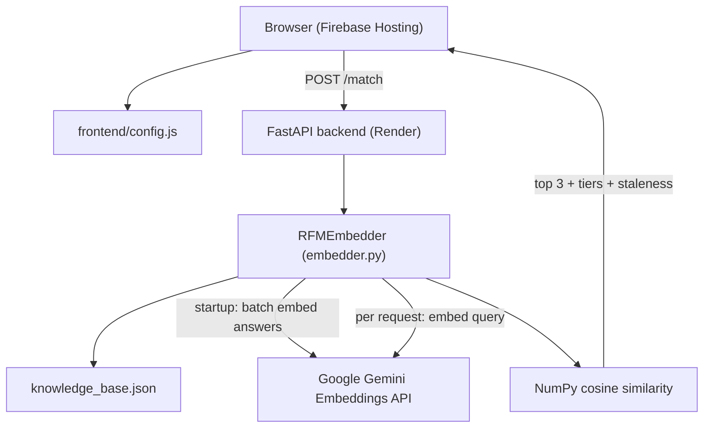
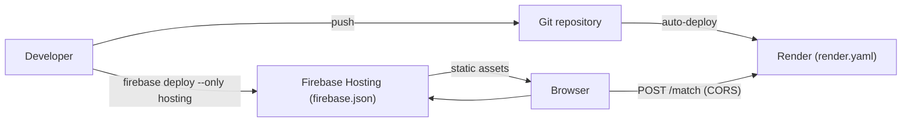
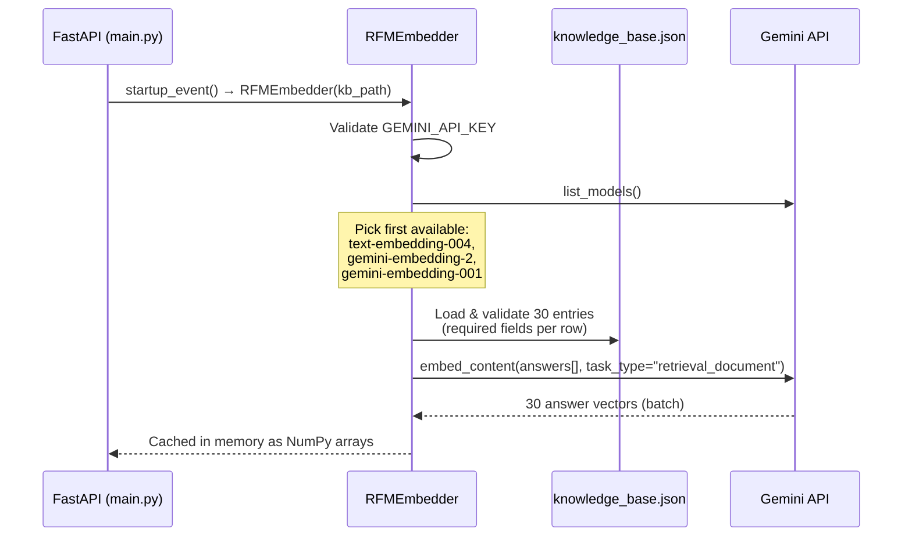
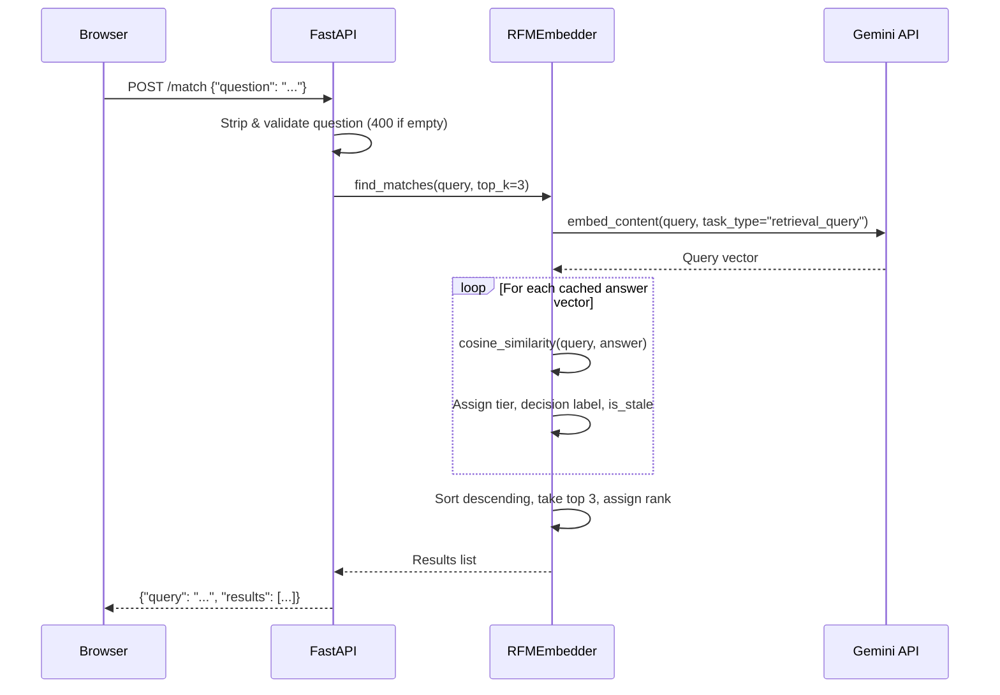

# Architecture: RFP Match

This document describes the system architecture, component design, data flows, deployment topology, and core algorithms for **RFP Match** — a semantic retrieval prototype for the fictional HR Tech SaaS company **PeopleOS**.

---

## 1. System Overview

RFP Match is a decoupled two-tier application:

1. **Frontend** — A static single-page app (vanilla HTML/CSS/JS) hosted on **Firebase Hosting**. The browser loads `config.js` to determine which backend URL to call, then POSTs user questions to the API.
2. **Backend** — A **Python FastAPI** service deployed on **Render**. At startup it loads a static knowledge base, batch-embeds all answers via the Gemini API, caches vectors in memory, and serves similarity-ranked matches at request time.

There is no database, authentication layer, or build pipeline. All persistent data lives in `backend/knowledge_base.json`.



### Production URLs

| Component | URL | Hosting |
|---|---|---|
| Frontend | https://rfpresponseassistant.web.app | Firebase project `rfpresponseassistant` |
| Backend | https://peopleos-rfp-response-assistant.onrender.com | Render service `rfp-match-backend` |

---

## 2. Deployment Architecture



### Backend — Render

Defined in `render.yaml`:

| Setting | Value |
|---|---|
| Service name | `rfp-match-backend` |
| Root directory | `backend/` |
| Build | `pip install -r requirements.txt` |
| Start | `uvicorn main:app --host 0.0.0.0 --port $PORT` |
| Health check | `GET /health` |

**Environment variables (Render dashboard):**

| Variable | Required | Default | Purpose |
|---|---|---|---|
| `GEMINI_API_KEY` | Yes | — | Gemini API authentication (set manually; never committed) |
| `APP_ENV` | No | `production` (set in `render.yaml`) | Controls CORS origin list |
| `FRONTEND_URL` | No | — | Adds an extra allowed CORS origin (e.g. staging frontend) |

On cold start (Render free tier), the service wakes, re-embeds all 30 knowledge base answers, and becomes ready. The frontend uses a 30-second fetch timeout to handle this.

### Frontend — Firebase Hosting

Defined in `firebase.json` and `.firebaserc`:

| Setting | Value |
|---|---|
| Public directory | `frontend/` |
| SPA rewrite | All routes → `/index.html` |
| Excluded from deploy | `config.dev.js`, `config.prod.js`, dotfiles, `node_modules` |

**Cache headers:**

| File | Cache-Control | Rationale |
|---|---|---|
| `index.html`, `config.js` | `no-cache, no-store, must-revalidate` | API URL and shell must update immediately after deploy |
| `app.js`, `style.css` | `public, max-age=31536000, immutable` | Safe to cache long-term; redeploy replaces files |

### Frontend API configuration

The active backend URL is not hard-coded in `app.js`. It is loaded from `window.RFP_MATCH_CONFIG` in `config.js`:

```javascript
window.RFP_MATCH_CONFIG = {
    API_URL: "https://peopleos-rfp-response-assistant.onrender.com/match",
    ENV: "production"
};
```

Switch environments with `scripts/Set-FrontendApiUrl.ps1`:

```powershell
./scripts/Set-FrontendApiUrl.ps1 -Env dev    # copies config.dev.js → config.js
./scripts/Set-FrontendApiUrl.ps1 -Env prod   # copies config.prod.js → config.js
./scripts/Set-FrontendApiUrl.ps1 -ApiUrl "https://staging.onrender.com/match"
```

Always run `-Env prod` before `firebase deploy --only hosting`.

Step-by-step release workflow, verification, and troubleshooting: [`deployment.md`](./deployment.md).

---

## 3. Component Design

### 3.1 Frontend

| File | Role |
|---|---|
| `index.html` | Two-column layout: question input (left) and results panel (right). Loads `config.js` before `app.js`. |
| `style.css` | PeopleOS design system via CSS variables. Responsive breakpoint at 900px (stacked layout). |
| `config.js` | Active runtime config — API URL and environment label. |
| `config.dev.js` | Development profile pointing at `http://127.0.0.1:8000/match`. Not deployed. |
| `config.prod.js` | Production profile — canonical reference for deployed backend URL. |
| `app.js` | Form handling, fetch with 30s AbortController timeout, error classification, result card rendering, local-only "Mark as Used" toggle. |

**Client behavior highlights:**

- Reads `API_URL` and `ENV` from `window.RFP_MATCH_CONFIG` (fallback: local dev URL).
- On transient failures (503, 502, timeout), keeps previous results visible while showing the error banner.
- Renders top 3 matches with rank, category badge, decision label, similarity bar, owner, dates, and stale warning.

### 3.2 Backend

| File | Role |
|---|---|
| `main.py` | FastAPI app: CORS, startup orchestration, `GET /health`, `POST /match`, HTTP error mapping. |
| `embedder.py` | `RFMEmbedder` class: Gemini model discovery, KB loading/validation, embedding cache, similarity scoring, confidence tiering, staleness flags. |
| `knowledge_base.json` | Static 30-entry PeopleOS Q&A database across 6 categories. |
| `update_kb_dates.py` | Offline maintenance script — rewrites `last_updated` and `review_due` dates in the KB file. |

**API surface (`main.py`):**

| Endpoint | Method | Purpose |
|---|---|---|
| `/health` | GET | Liveness check; reports `embedder_ready` and `APP_ENV` |
| `/match` | POST | Accept `{ "question": "..." }`, return top 3 ranked matches |

**CORS policy (`main.py`):**

CORS is environment-driven, not open:

| `APP_ENV` | Allowed origins |
|---|---|
| `production` | `https://rfpresponseassistant.web.app`, `https://rfpresponseassistant.firebaseapp.com` |
| `development` | Production origins **plus** localhost variants on ports 5500, 3000, and 8000 |

`FRONTEND_URL`, if set, is appended to the allowed list. Only `GET` and `POST` with `Content-Type` header are permitted.

**Startup resilience:**

If embedder initialization fails (missing API key, bad KB, Gemini outage), the exception is logged and the server **stays alive** with `embedder = None`. `/health` remains reachable; `/match` returns **503** until the service is restarted successfully.

---

## 4. Data Flow

### 4.1 Startup Flow (embedding cache)



Key detail: all 30 answer embeddings are computed in **one batch API call** at startup, not one call per entry.

### 4.2 Request Matching Flow



### 4.3 Error mapping

| Condition | HTTP status |
|---|---|
| Empty/whitespace question | 400 |
| Embedder not initialized | 503 |
| Transient Gemini failure (timeout, rate limit, quota) | 503 |
| Permanent Gemini/upstream error | 502 |
| Internal config/data error | 500 |
| Unexpected exception | 500 |

---

## 5. Embedding & Retrieval Design

### 5.1 What gets embedded

| Content | When | Gemini `task_type` |
|---|---|---|
| Knowledge base **answers** (not questions) | Once at startup | `retrieval_document` |
| User **question** | Per request | `retrieval_query` |

The matched question text from the KB is returned in the response for human readability, but similarity is computed against answer vectors. This follows Gemini's recommended retrieval query/document pairing.

### 5.2 Model selection

At startup, `RFMEmbedder` calls `genai.list_models()` and picks the first match from this priority list:

1. `models/text-embedding-004`
2. `models/gemini-embedding-2`
3. `models/gemini-embedding-001`

If model listing fails, it falls back to `models/text-embedding-004`.

### 5.3 Cosine similarity

$$\text{similarity} = \frac{A \cdot B}{\|A\| \|B\|}$$

Implemented in `compute_similarity()`. Returns `0.0` if either vector has zero norm.

### 5.4 Confidence classification

Fixed thresholds applied to every scored match:

| Similarity score | Confidence tier | Decision label | UI color token |
|---|---|---|---|
| ≥ 0.85 | High | Auto-Answer | `green` |
| 0.60 – 0.84 | Medium | Review Required | `amber` |
| < 0.60 | Low | Escalate to SME | `red` |

Thresholds are hard-coded in `embedder.py` — not configurable at runtime.

### 5.5 Staleness logic

Evaluated independently of similarity score at request time:

$$\text{is\_stale} = \text{today} > \text{review\_due}$$

- Malformed `review_due` dates are treated as stale (safe default).
- A high-confidence match can still be flagged stale if past its review date.

---

## 6. Knowledge Base

**File:** `backend/knowledge_base.json`

**Schema (required fields per entry):**

| Field | Type | Purpose |
|---|---|---|
| `id` | string | Unique identifier (e.g. `KB001`) |
| `category` | string | One of 6 categories |
| `question` | string | Canonical KB question (shown as `matched_question` in results) |
| `answer` | string | Verified answer text (embedded for retrieval) |
| `last_updated` | string (ISO date) | Last content update date |
| `review_due` | string (ISO date) | Review deadline — drives staleness flag |
| `owner` | string | Responsible team |

**Categories (30 entries total):**

- Security & Compliance
- Integrations & APIs
- Implementation & Onboarding
- Pricing & Licensing
- SLAs & Support
- Customer References & Case Studies

**Maintenance:** `backend/update_kb_dates.py` rewrites dates in place using a fixed anchor date. It is not invoked during request serving.

---

## 7. Testing & Evaluation

Executable scripts under `backend/tests/` (not a pytest suite):

| Script | Network | Purpose |
|---|---|---|
| `config.py` | — | Shared URL resolver: `--local` flag, `TEST_BASE_URL` env var, or deployed default |
| `test_backend.py` | Yes | Smoke test: `/health` + 5 sample `/match` queries |
| `run_evals.py` | Yes | 50-case labeled evaluation scorecard |
| `test_distribution.py` | No (local embedder) | Similarity distribution for true matches |
| `test_mismatched.py` | No (local embedder) | Adversarial / unrelated query distribution |
| `test_staleness.py` | No | Date logic verification |

Default test target: `https://peopleos-rfp-response-assistant.onrender.com`

---

## 8. Project Directory Structure

```text
RFPProject/
├── README.md
├── render.yaml                  # Render backend deployment blueprint
├── firebase.json                # Firebase Hosting config (cache headers, rewrites)
├── .firebaserc                  # Firebase project mapping
├── scripts/
│   └── Set-FrontendApiUrl.ps1   # Switch frontend config.js between dev/prod/custom
├── backend/
│   ├── main.py                  # FastAPI app — endpoints, CORS, startup
│   ├── embedder.py              # Embedding engine, similarity, tiering, staleness
│   ├── knowledge_base.json      # 30-entry static knowledge base
│   ├── update_kb_dates.py       # Offline KB date maintenance
│   ├── .env.template            # Local env template (GEMINI_API_KEY, APP_ENV)
│   ├── requirements.txt
│   └── tests/
│       ├── config.py            # Shared test URL resolver
│       ├── test_backend.py
│       ├── test_distribution.py
│       ├── test_mismatched.py
│       ├── test_staleness.py
│       ├── run_evals.py
│       └── eval_set.json        # 50 labeled evaluation cases
├── frontend/
│   ├── index.html
│   ├── config.js                # Active API config (loaded at runtime)
│   ├── config.dev.js            # Dev profile (excluded from Firebase deploy)
│   ├── config.prod.js           # Prod profile (excluded from Firebase deploy)
│   ├── app.js
│   └── style.css
└── docs/
    ├── architecture.md          # This document
    ├── deployment.md            # Deployment workflow and release checklist
    ├── edgecase.md
    ├── phaseWiseImplementationPlan.md
    └── problemstatement.txt
```

---

## 9. Intentional Limitations

This architecture is scoped to a POC:

- No authentication, rate limiting, or multi-tenancy
- No persistent storage or feedback loop
- No PDF/document ingestion
- In-memory embedding cache rebuilt on every process restart
- Confidence thresholds fixed in code
- Embedding-based retrieval does not reliably handle negation or multi-part compound questions

For the product rationale, threshold calibration story, and gap analysis, see the other documents in `/docs` and the README.
