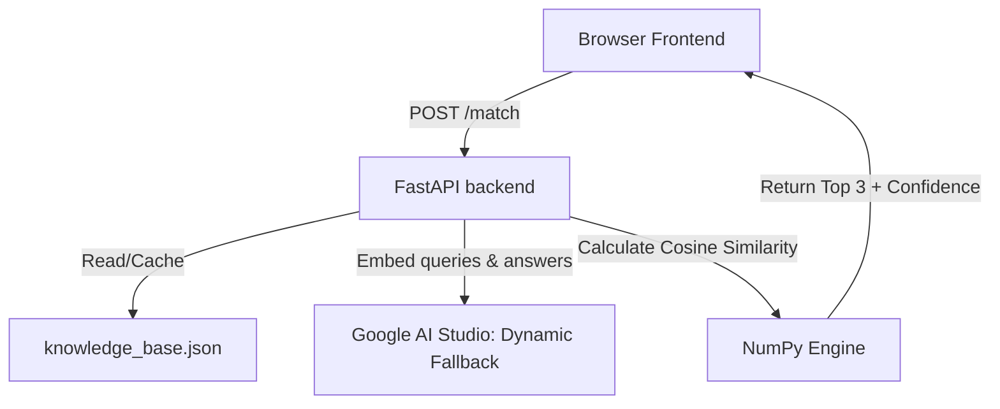
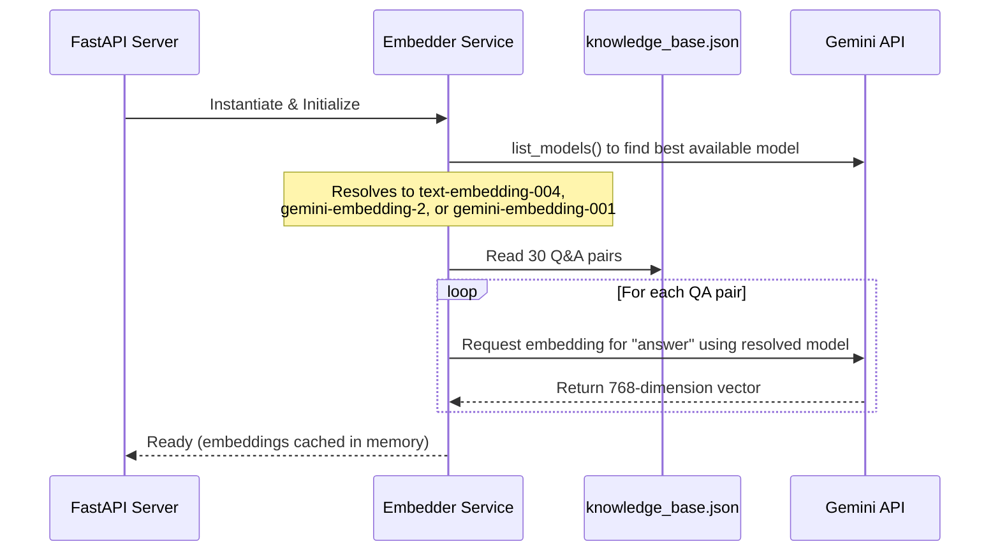
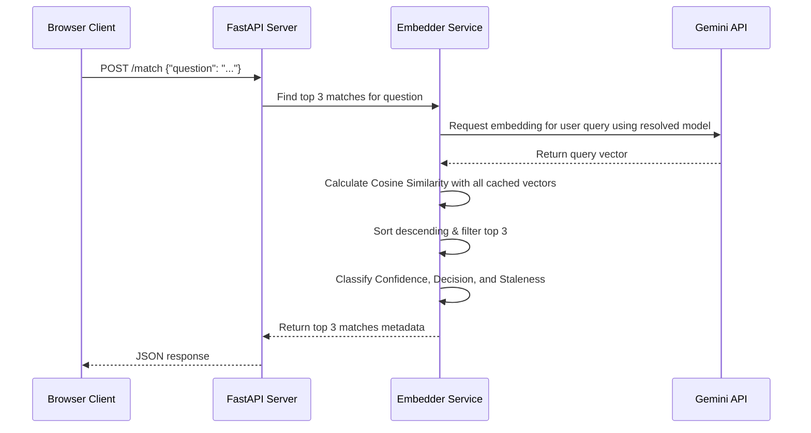

# Architecture Specification: RFP Match

This document describes the high-level architecture, component designs, data flows, and algorithms for **RFP Match**, the semantic search tool for the fictional HR Tech SaaS company **PeopleOS**.

---

## 1. System Overview

RFP Match is a lightweight Proof of Concept (POC) designed to run as a decoupled application:
1.  **Backend**: A Python FastAPI server that serves matching requests. It handles reading the static knowledge base file, generating embeddings via the Google Gemini API, caching embeddings in memory, and calculating similarities.
2.  **Frontend**: A responsive vanilla HTML/CSS/JS application that communicates with the backend via REST API calls and is hosted on Firebase Hosting.



---

## 2. Component Design

### 2.1 Frontend Component
*   **HTML (`index.html`)**: Semantic markup providing a clean, two-column layout. Contains input area (left) and results panel (right).
*   **CSS (`style.css`)**: Implements the PeopleOS design system using native CSS variables. Supports responsive layout (collapses to a single-column layout on mobile) and animations/transitions (loading spinner, button states, progress bars).
*   **JavaScript (`app.js`)**: Coordinates user events, triggers async fetch requests to the backend, caches previous results to avoid flickering, and renders dynamic UI components.

### 2.2 Backend Component
*   **Web Framework (`main.py`)**: FastAPI application exposing:
    *   `GET /health`: For monitoring service availability.
    *   `POST /match`: Accepts input query and returns sorted top 3 matching JSON answers.
    *   **CORS Middleware**: Configured to allow all origins during this prototype phase.
*   **Similarity Matcher (`embedder.py`)**: Core matching service.
    *   **In-Memory Embedding Cache**: Embeds all 30 knowledge base answers once at startup using a dynamic fallback mechanism to find the best available model.
    *   **Vector Engine**: Converts the user's text question to an embedding and performs cosine similarity calculations.
*   **Storage (`knowledge_base.json`)**: A static database containing 30 Q&A pairs spanning 6 distinct categories.

---

## 3. Data Flow

### 3.1 Startup Flow (Cache Generation & Model Resolution)


### 3.2 Request Matching Flow


---

## 4. Key Logic & Algorithms

### 4.1 Cosine Similarity
Cosine similarity measures the cosine of the angle between two multi-dimensional vectors (query vector $A$ and knowledge base vector $B$):

$$\text{similarity} = \frac{A \cdot B}{\|A\| \|B\|} = \frac{\sum_{i=1}^{n} A_i B_i}{\sqrt{\sum_{i=1}^{n} A_i^2} \sqrt{\sum_{i=1}^{n} B_i^2}}$$

Using NumPy:
```python
dot_product = np.dot(query_vector, target_vector)
norm_query = np.linalg.norm(query_vector)
norm_target = np.linalg.norm(target_vector)
similarity = dot_product / (norm_query * norm_target)
```

### 4.2 Confidence Classification & Color Coding
The similarity score is mapped into three decision tiers:

| Similarity Score | Confidence Tier | Decision Label | Visual Color |
| :--- | :--- | :--- | :--- |
| $\ge 0.85$ | High | Auto-Answer | Green (`#10b981` / rgb(16, 185, 129)) |
| $0.60 \text{ to } 0.84$ | Medium | Review Required | Amber (`#f59e0b` / rgb(245, 158, 11)) |
| $< 0.60$ | Low | Escalate to SME | Red (`#ef4444` / rgb(239, 68, 68)) |

### 4.3 Staleness Logic
Staleness detection runs at the time of request:
$$\text{is\_stale} = \text{Current Date} > \text{review\_due}$$
This evaluation is decoupled from the embedding match score. A matching answer with high similarity can still be flagged as `is_stale = true` if it has passed its review threshold.

---

## 5. Project Directory Structure
```text
rfp-match-poc/
├── backend/
│   ├── tests/
│   │   ├── eval_set.json       # Labeled evaluation dataset (50 cases)
│   │   ├── run_evals.py        # Automated scorecard runner
│   │   ├── test_backend.py     # Endpoint matching validation
│   │   ├── test_staleness.py   # Date logic validation
│   │   ├── test_distribution.py# Similarity distribution test
│   │   └── test_mismatched.py  # Mismatched/Unrelated query test
│   ├── main.py                 # FastAPI Web API
│   ├── embedder.py             # Vector Engine & Model Fallback
│   ├── knowledge_base.json     # 30-entry static DB (40% stale / 60% active)
│   └── requirements.txt
├── frontend/
│   ├── index.html              # Dynamic user interface
│   ├── style.css               # Native CSS styling
│   └── app.js                  # Fetch integration
├── firebase.json               # Firebase deployment parameters
├── .firebaserc                 # Firebase workspace configuration
└── .gitignore                  # Git exclusions (.env, docs/, caches)
```
