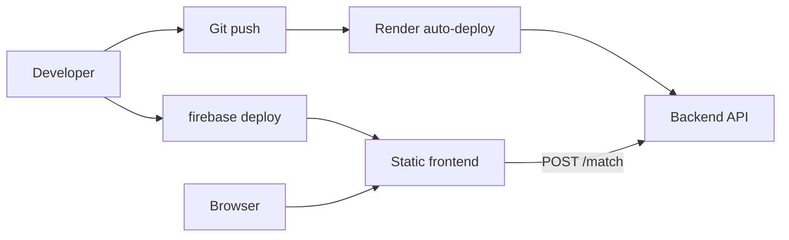

# Deployment Workflow

This document describes how to deploy RFP Match to production: backend on **Render**, frontend on **Firebase Hosting**, environment configuration, verification, and the full release checklist.

For system design and component details, see [`architecture.md`](./architecture.md).

---

## Overview

RFP Match uses two independent deployment targets:

| Component | Platform | Config file | Production URL |
|---|---|---|---|
| Backend (FastAPI) | Render | `render.yaml` | https://peopleos-rfp-response-assistant.onrender.com |
| Frontend (static SPA) | Firebase Hosting | `firebase.json`, `.firebaserc` | https://rfpresponseassistant.web.app |

There is no CI/CD pipeline in the repository. Backend deploys automatically when you push to the connected Git branch on Render. Frontend deploys manually via the Firebase CLI.



---

## Prerequisites

### One-time setup

**Backend (Render)**

1. Create a [Render](https://render.com) account.
2. Connect the Git repository and create a web service from `render.yaml`, or manually configure a service matching the blueprint:
   - Root directory: `backend`
   - Build: `pip install -r requirements.txt`
   - Start: `uvicorn main:app --host 0.0.0.0 --port $PORT`
   - Health check path: `/health`
3. Set `GEMINI_API_KEY` in the Render dashboard (see [Environment variables](#environment-variables)).

**Frontend (Firebase)**

1. Install the [Firebase CLI](https://firebase.google.com/docs/cli):
   ```bash
   npm install -g firebase-tools
   ```
2. Log in and confirm the project:
   ```bash
   firebase login
   firebase use rfpresponseassistant
   ```
   The default project is defined in `.firebaserc`.

**Local tooling**

- Python 3 with `pip` (for local testing before release)
- PowerShell (for `scripts/Set-FrontendApiUrl.ps1`; manual config copy works on other shells)
- `curl` or similar for health checks

---

## Environment Variables

### Backend

| Variable | Required | Local default | Production (Render) | Description |
|---|---|---|---|---|
| `GEMINI_API_KEY` | **Yes** | Set in `backend/.env` | Set in Render dashboard | Google AI Studio API key for Gemini embeddings. Never commit. |
| `APP_ENV` | No | `development` (in `.env.template`) | `production` (set in `render.yaml`) | Controls CORS origins and is returned by `/health`. |
| `FRONTEND_URL` | No | — | Optional in Render dashboard | Adds one extra allowed CORS origin (e.g. staging frontend URL). |

**Local setup:**

```bash
cd backend
cp .env.template .env
# Edit .env — set GEMINI_API_KEY and APP_ENV=development
```

**CORS behavior by `APP_ENV`:**

| `APP_ENV` | Allowed origins |
|---|---|
| `production` | `https://rfpresponseassistant.web.app`, `https://rfpresponseassistant.firebaseapp.com`, plus `FRONTEND_URL` if set |
| `development` | Production origins **plus** `http://localhost:5500`, `http://127.0.0.1:5500`, `http://localhost:3000`, `http://127.0.0.1:3000`, `http://localhost:8000`, `http://127.0.0.1:8000` |

### Frontend

The frontend has **no server-side environment variables**. Runtime config is baked into the static file `frontend/config.js`:

```javascript
window.RFP_MATCH_CONFIG = {
    API_URL: "https://peopleos-rfp-response-assistant.onrender.com/match",
    ENV: "production"
};
```

| File | Purpose | Deployed? |
|---|---|---|
| `config.js` | Active config loaded by `index.html` | **Yes** — must point at production backend before deploy |
| `config.prod.js` | Canonical production reference | No (excluded by `firebase.json`) |
| `config.dev.js` | Local development (`http://127.0.0.1:8000/match`) | No (excluded by `firebase.json`) |

Switch `config.js` with the PowerShell helper:

```powershell
./scripts/Set-FrontendApiUrl.ps1 -Env dev     # local backend
./scripts/Set-FrontendApiUrl.ps1 -Env prod    # production backend
./scripts/Set-FrontendApiUrl.ps1 -ApiUrl "https://your-staging.onrender.com/match"
```

On bash/macOS without PowerShell, copy manually:

```bash
cp frontend/config.prod.js frontend/config.js   # production
cp frontend/config.dev.js frontend/config.js    # local
```

### Test scripts (optional)

Used only when running `backend/tests/*.py` against a non-default URL:

| Variable / flag | Purpose |
|---|---|
| `--local` | Target `http://127.0.0.1:8000` |
| `TEST_BASE_URL` | Target any custom backend URL |

These do not affect deployed services.

---

## Backend Deployment (Render)

### How it works

1. Render reads `render.yaml` from the repository root.
2. On each push to the connected branch, Render:
   - Checks out the repo
   - Runs `pip install -r requirements.txt` inside `backend/`
   - Starts `uvicorn main:app --host 0.0.0.0 --port $PORT`
   - Polls `GET /health` until the service responds
3. On startup, the FastAPI app embeds all 30 knowledge base answers via Gemini and caches vectors in memory.

### Deploy steps

1. **Commit and push** backend changes to the branch Render watches (typically `main`):
   ```bash
   git push origin main
   ```
2. **Monitor** the deploy in the Render dashboard (Logs tab).
3. **Verify** once the deploy completes (see [Post-deploy verification](#post-deploy-verification)).

### First-time / manual Render setup

If the service is not yet connected to `render.yaml`:

1. Create a new **Web Service** → connect the Git repo.
2. Set **Root Directory** to `backend`.
3. Set build and start commands to match `render.yaml`.
4. Add environment variables:
   - `GEMINI_API_KEY` — your key (mark as secret)
   - `APP_ENV` — `production`
5. Set **Health Check Path** to `/health`.

### Backend-only release

Use when changes touch only `backend/` (no frontend deploy needed):

1. Push to the connected branch.
2. Wait for Render deploy to finish.
3. Run health check and smoke tests (below).
4. No Firebase step required unless the backend URL changed (rare).

### Cold starts

On Render's free tier, inactive services spin down. The first request after idle time may take **30–60 seconds** while the instance starts and re-embeds the knowledge base. The frontend uses a 30-second fetch timeout and shows a retry message on timeout.

---

## Frontend Deployment (Firebase Hosting)

### How it works

1. Firebase serves static files from the `frontend/` directory.
2. `firebase.json` excludes `config.dev.js` and `config.prod.js`; only `config.js` is uploaded.
3. All routes rewrite to `index.html` (single-page app).
4. Cache headers:
   - `index.html`, `config.js` — no cache (immediate updates)
   - `app.js`, `style.css` — long-lived immutable cache (same paths replaced on redeploy)

### Deploy steps

1. **Set production API URL** in `config.js`:
   ```powershell
   ./scripts/Set-FrontendApiUrl.ps1 -Env prod
   ```
2. **Confirm** `frontend/config.js` matches `frontend/config.prod.js` (production Render `/match` URL).
3. **Deploy**:
   ```bash
   firebase deploy --only hosting
   ```
4. **Verify** the live site (see [Post-deploy verification](#post-deploy-verification)).

### Frontend-only release

Use when changes touch only `frontend/`:

1. Run `./scripts/Set-FrontendApiUrl.ps1 -Env prod`.
2. `firebase deploy --only hosting`.
3. Open https://rfpresponseassistant.web.app and submit a test question.

### If the backend URL changes

Update all three places, then redeploy the frontend:

1. `frontend/config.prod.js` — canonical production URL
2. `frontend/config.js` — via `Set-FrontendApiUrl.ps1 -Env prod`
3. `backend/tests/config.py` — `DEPLOYED_BASE_URL` (for test scripts)

---

## Release Steps (Full Stack)

Use this checklist when shipping changes that may affect both backend and frontend, or for any production release you want to validate end-to-end.

### 1. Pre-release (local)

```bash
# Backend — run locally with APP_ENV=development
cd backend
pip install -r requirements.txt
uvicorn main:app --reload

# In another terminal — smoke test local backend
py backend/tests/test_backend.py --local
py backend/tests/test_staleness.py
```

For frontend changes, switch to dev config and test against the local backend:

```powershell
./scripts/Set-FrontendApiUrl.ps1 -Env dev
# Open frontend/index.html or use Live Server on port 5500
```

### 2. Deploy backend

```bash
git push origin main
```

Wait for Render deploy to complete. Check logs for:

- `Using embedding model: models/...`
- `Embedder initialization complete.`

Avoid deploying a broken backend before the frontend if API response shapes changed.

### 3. Verify backend

```bash
curl https://peopleos-rfp-response-assistant.onrender.com/health
```

Expected:

```json
{"status":"ok","env":"production","embedder_ready":true}
```

Run remote smoke tests:

```bash
py backend/tests/test_backend.py
```

Optional — full evaluation suite:

```bash
py backend/tests/run_evals.py
```

If `embedder_ready` is `false`, **do not deploy the frontend** until the backend is fixed.

### 4. Prepare frontend config

```powershell
./scripts/Set-FrontendApiUrl.ps1 -Env prod
```

Ensure you are **not** deploying with `-Env dev` or a stale custom URL.

### 5. Deploy frontend

```bash
firebase deploy --only hosting
```

Note the hosting URL in the CLI output (should match `https://rfpresponseassistant.web.app`).

### 6. Post-deploy verification (production)

1. Open https://rfpresponseassistant.web.app
2. Open browser DevTools → Network; confirm requests go to `peopleos-rfp-response-assistant.onrender.com/match`
3. Submit a known question (e.g. "Does PeopleOS support Single Sign-On?")
4. Confirm top match returns with rank, decision label, and similarity score
5. If the backend was cold, retry once if the first request times out

### 7. Post-release (local cleanup)

Restore dev config so local work does not accidentally hit production:

```powershell
./scripts/Set-FrontendApiUrl.ps1 -Env dev
```

---

## Post-Deploy Verification

### Backend health

```bash
curl https://peopleos-rfp-response-assistant.onrender.com/health
```

| Field | Healthy value | Action if wrong |
|---|---|---|
| `status` | `"ok"` | Check Render logs |
| `env` | `"production"` | Set `APP_ENV=production` in Render |
| `embedder_ready` | `true` | Check `GEMINI_API_KEY`, KB file, Gemini API status |

### Backend match smoke test

```bash
curl -X POST https://peopleos-rfp-response-assistant.onrender.com/match \
  -H "Content-Type: application/json" \
  -d "{\"question\": \"Does PeopleOS support Single Sign-On?\"}"
```

Expect HTTP 200 with a `results` array containing at least one match.

### Automated test scripts

```bash
py backend/tests/test_backend.py          # /health + 5 sample queries
py backend/tests/run_evals.py             # 50-case labeled suite (slower)
```

### Frontend manual check

- Page loads at https://rfpresponseassistant.web.app
- Submit button triggers loading state
- Results render with decision badges and similarity bars
- No CORS errors in the browser console

---

## Staging and Custom Environments

There is no separate staging stack in the repository, but you can stand one up:

**Staging backend (Render)**

1. Create a second Render web service from the same repo/branch.
2. Set `GEMINI_API_KEY` and `APP_ENV=production`.
3. Set `FRONTEND_URL` to your staging Firebase URL (if different from production origins).

**Staging frontend (Firebase)**

1. Use a separate Firebase project or hosting site, **or** deploy locally with a custom config:
   ```powershell
   ./scripts/Set-FrontendApiUrl.ps1 -ApiUrl "https://your-staging.onrender.com/match"
   firebase deploy --only hosting
   ```
2. Ensure the staging backend's CORS allows the staging frontend origin (`FRONTEND_URL` or `APP_ENV=development` for localhost testing).

**Test against staging**

```bash
TEST_BASE_URL=https://your-staging.onrender.com py backend/tests/test_backend.py
```

---

## Troubleshooting

| Symptom | Likely cause | Fix |
|---|---|---|
| `/health` returns `embedder_ready: false` | Missing/invalid `GEMINI_API_KEY`, bad KB JSON, Gemini outage | Check Render logs at startup; verify env var and `knowledge_base.json` |
| Frontend "Could not reach the matching service" | Backend down, wrong URL in `config.js`, CORS block | Verify `/health`; run `Set-FrontendApiUrl.ps1 -Env prod`; check browser console for CORS |
| Request times out after 30s | Render cold start | Wait and retry; first request after idle wakes the service |
| HTTP 503 on `/match` | Transient Gemini failure or embedder not ready | Retry; check Render logs |
| HTTP 502 on `/match` | Permanent Gemini/upstream error | Check API key quota and Gemini status |
| CORS error in browser | Frontend origin not in backend allow list | Ensure `APP_ENV=production` and frontend is on `rfpresponseassistant.web.app`; add `FRONTEND_URL` for custom domains |
| Old API URL after frontend deploy | Deployed with dev `config.js` | Run `Set-FrontendApiUrl.ps1 -Env prod` and redeploy |
| UI works but tests fail | Tests target wrong URL | Use `--local` or `TEST_BASE_URL` |

---

## Deployment Checklist (Quick Reference)

**Backend**

- [ ] Changes pushed to Render-connected branch
- [ ] Render deploy succeeded
- [ ] `GET /health` → `embedder_ready: true`
- [ ] `py backend/tests/test_backend.py` passes

**Frontend**

- [ ] `./scripts/Set-FrontendApiUrl.ps1 -Env prod` run
- [ ] `firebase deploy --only hosting` succeeded
- [ ] Live site loads and returns matches
- [ ] `./scripts/Set-FrontendApiUrl.ps1 -Env dev` restored for local work

**Secrets**

- [ ] `GEMINI_API_KEY` set in Render only — not in Git
- [ ] `backend/.env` not committed

---

## Related Files

| File | Role |
|---|---|
| `render.yaml` | Render service blueprint |
| `firebase.json` | Hosting paths, cache headers, rewrites |
| `.firebaserc` | Firebase project ID (`rfpresponseassistant`) |
| `backend/.env.template` | Local env variable template |
| `frontend/config.prod.js` | Production API URL reference |
| `frontend/config.dev.js` | Local development API URL |
| `scripts/Set-FrontendApiUrl.ps1` | Switch active frontend config |
| `backend/tests/config.py` | Default deployed URL for test scripts |
