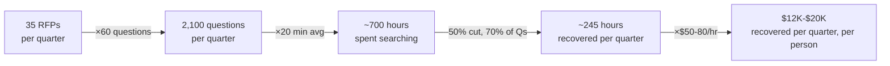
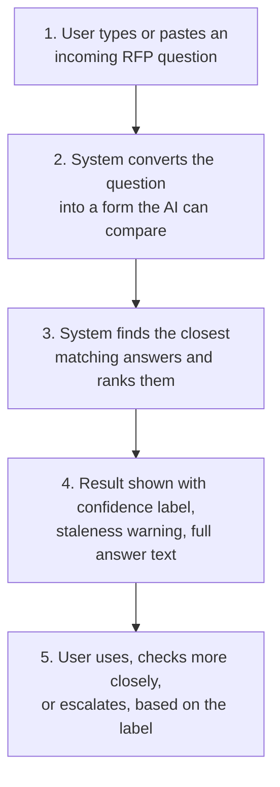
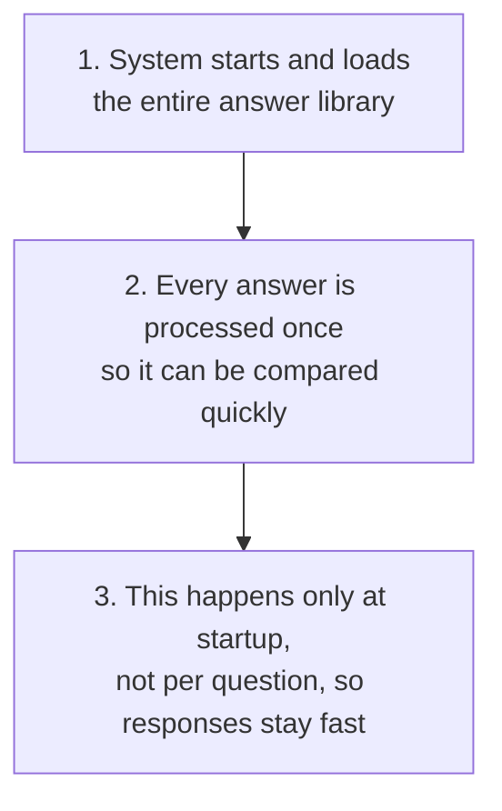
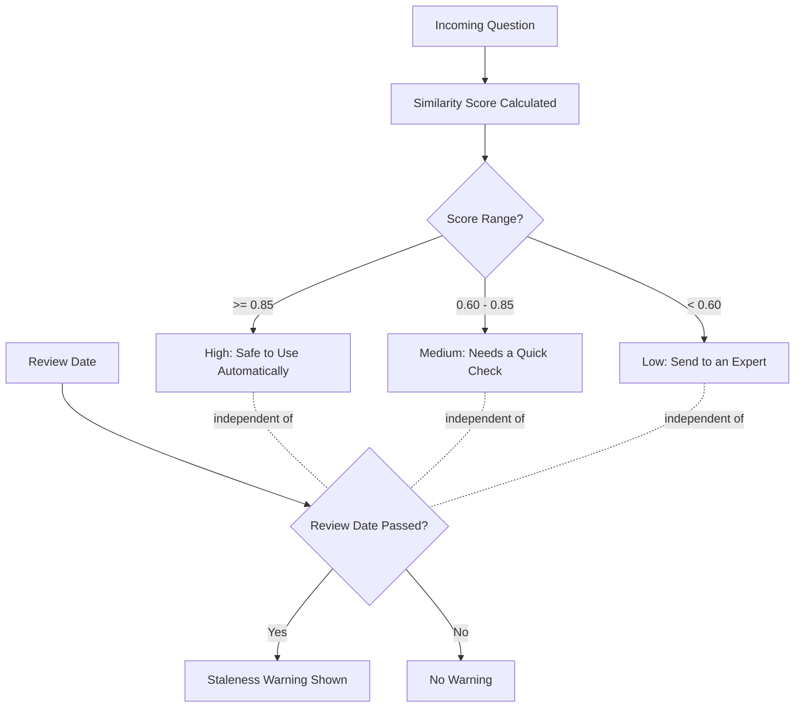

# Product Requirements Document 📋

### RFP Match: A Confidence-Calibrated Retrieval Prototype 🎯

 

**Author:** Sunidhi Mishra &nbsp;·&nbsp; **Live Demo:** [rfpresponseassistant.web.app](https://rfpresponseassistant.web.app/)

---

## 📑 Table of Contents

1. [Problem Statement](#1-problem-statement)
2. [Jobs to Be Done](#2-jobs-to-be-done)
3. [Approach and Competing Hypotheses](#3-approach-and-competing-hypotheses)
4. [User Persona](#4-user-persona)
5. [Goals](#5-goals)
6. [Metrics](#6-metrics)
7. [Impact Sizing Model](#7-impact-sizing-model)
8. [Non-Goals and Constraints](#8-non-goals-and-constraints)
9. [Solution Alignment](#9-solution-alignment)
10. [Key Features: Plan of Record](#10-key-features-plan-of-record)
11. [Key Flows](#11-key-flows)
12. [Key Logic](#12-key-logic)
13. [Validation and Evidence](#13-validation-and-evidence)
14. [Risks and Mitigations](#14-risks-and-mitigations)
15. [Future Considerations](#15-future-considerations)
16. [Appendix: Supporting Documents](#16-appendix-supporting-documents)

---

## Executive Summary 🚀

This document explains what RFP Match is, why it was built, and what it proves.

Sales teams answering RFPs waste hours searching for answers they have already written before. This project tests whether an AI tool that finds those answers automatically, and is honest about how confident it is in each match, can solve that problem without introducing new risk.

I built a small working prototype for a fictional HR tech company called PeopleOS. It takes an incoming RFP question, searches a library of pre-written answers, and returns the best matches along with a clear label: safe to use automatically, needs a quick human check, or send this to an expert.

The hardest part was not building the search. It was deciding when the system should be trusted to answer on its own. I tested that decision with real data instead of guessing, and the result is a system that never confidently sends a wrong answer in testing, even though it means asking for human review more often than would feel maximally convenient.

This is a narrow, honest prototype. It does not solve the full problem. What it does not solve, and why, is documented as carefully as what it does solve.

---

## 1. Problem Statement 💭

### The Situation

When a large company wants to buy software, they send a detailed list of questions, called a Request for Proposal or RFP, to several vendors at once. Each vendor has to answer every question accurately, usually within a tight deadline of 5 to 7 days.

The person responsible for answering these questions, typically a Solutions Consultant or Sales Engineer, spends most of their time not writing new answers but searching for answers their company has already written before. A typical RFP has 50 to 150 questions. Most of them are recurring: security certifications, integration capabilities, pricing structure, implementation timelines. Despite this repetition, the answers live scattered across shared drives, old emails, and individual memory, with no reliable way to find them quickly.

### Why This Matters

The cost is not just time, although the time cost is significant. It is also consistency and accuracy risk. Different people retrieve different versions of the same answer. Some are outdated. Some contradict each other. Nobody has an easy way to know which version is current.

Full detail on the scale of this problem, drawn from public research and practitioner discussions, is available in the Problem Research Document (see Appendix).

### The Hypothesis

This project tests one specific idea: if an organization's verified answers are stored in a structured, searchable library, an AI system that finds the right answer and is explicit about how confident it is in that match can meaningfully reduce search time without introducing unacceptable accuracy risk, as long as the system is honest about when it does not know the answer.

### Business Impact, If This Works

A rough illustrative estimate: if a Solutions Consultant handles 35 RFPs per quarter with roughly 60 recurring questions per RFP, and each question currently takes 15 to 25 minutes to search and retrieve manually, even cutting that time by half would save hundreds of hours per person per quarter. Full reasoning behind this estimate is in Section 6.

---

## 2. Jobs to Be Done 🎯

Stated as a single job, the way the target user would actually describe it: when a recurring RFP question comes in, I want to find the answer my company has already verified, so I can spend my limited time reviewing it for accuracy instead of searching for it from scratch.

Underneath that main job are three smaller jobs the current process fails to support well:

- When I find an old answer, I want to know quickly whether it is still accurate, so I do not have to guess or manually re-verify it every time
- When no good answer exists yet, I want to know that immediately, so I can route the question to the right person instead of wasting time searching for something that was never written down
- When I am under deadline pressure, I want the system to be honest about its own uncertainty, so I only spend careful review time where it is actually needed

This project is built specifically around the first job and the first two supporting jobs. The third, being honest about uncertainty under pressure, is really a statement about system design philosophy, and it shaped the decision to make confidence explicit and tiered rather than hidden behind a single suggested answer, covered in detail in the next section.

---

## 3. Approach and Competing Hypotheses 🧭

### Why Retrieval, Not Generation

Two broad approaches exist for AI-assisted RFP response: generating new answers with AI, or retrieving existing, human-verified answers and matching them to incoming questions.

Generation without a grounded source of truth risks the AI making up plausible-sounding but inaccurate answers, known as hallucination. For a domain where wrong answers about security certifications or contractual commitments carry real consequences, this risk is too high.

This project chose retrieval. The system only ever returns answers that a human has already written and verified. The AI's job is to find the right one quickly, not to invent new content.

### Why Confidence Scoring Was the Central Design Choice

Simply returning a matched answer is not enough. Every existing tool in this space already does that. What none of them do well is tell the user how much to trust each match.

This project's central design decision was to make that trust signal explicit. Every result comes with a clear, tiered recommendation: safe to use automatically, needs a quick human check, or send this to an expert. This turns an implicit, hidden judgment call into an explicit, visible one.

### Competing Hypotheses Considered

Three genuinely different approaches were weighed against each other before settling on the one described above. Each represents a different bet about where the real problem actually lives.

**Hypothesis A: The problem is a missing platform.** Under this view, the reason RFP response is slow is that companies lack a complete, integrated system: content library, workflow routing, approval chains, and analytics all in one place. The fix would be to build a full competing platform. This was rejected as the framing for this project. Building a complete competitor to established players with years of head start was not feasible in the available time, and more importantly, it would not have isolated or tested any single, specific mechanism. It would have diluted focus across ten shallow features instead of one well-tested one.

**Hypothesis B: The problem is a missing writer.** Under this view, the bottleneck is that answers take too long to compose, so an AI that drafts new answers on demand would solve it. This was rejected because it assumes the hard part is writing, when the evidence, both from the target persona's own description of their workflow and from how existing tools are used, points to searching and verifying being the actual time sink, not composition. Generation without grounding also introduces a hallucination risk that is unacceptable in a domain with real compliance and contractual stakes.

**Hypothesis C: The problem is a missing trust signal.** Under this view, retrieval tools already exist and work reasonably well at finding candidate answers, but they fail to tell the user how much to trust any given suggestion, which means the human still has to redo the verification work the tool was supposed to remove. This was the hypothesis this project chose to test, since it is the one gap not addressed by any of the five established competitors reviewed in the Competitive Landscape document, and it was narrow enough to build and rigorously test within the available time.

The project is, in effect, a bet that Hypothesis C is the highest-leverage one to test first. It does not rule out that A or B might also matter, only that C was the most testable and the least already solved by the existing market.

---

## 4. User Persona 👥

<b>💼 Arjun Mehta</b>

**Solutions Consultant · Deadline-Driven · High Accountability · Low Tolerance for Silent Risk**

Mid-market to enterprise B2B SaaS company · 3 to 6 years in the role · Owns 60 to 80 percent of the technical, security, and compliance questions across 25 to 40 RFPs per quarter

**DISCOVERY**
An RFP question arrives that looks nearly identical to one answered months earlier. Arjun searches the shared archive and finds a matching answer in an old document.

**TRUST STEP**
He trusts it. The answer was correct when it was written, and nothing on the page tells him otherwise. Under a five-day deadline with roughly 60 questions still to go, there is no time to independently re-verify something that already looks right.

**BREAKDOWN**
The company's data storage policy had actually changed six months earlier. Nobody updated the answer in the archive. It goes out to the prospect exactly as written. The deal falls apart over it.

> **Behavioral Insight:** A correct-looking answer with no freshness signal gets trusted exactly the same as a genuinely current one. The risk is invisible until it is too late to matter.

> **Root Cause:** This is not an accuracy problem. It is a staleness-visibility problem. The archive was never wrong about what the answer used to say. It was just silent about whether that was still true.

<b>🛡️ Meera Iyer</b>

**Security & Compliance Lead · Accountable on Paper, Uninformed in Practice**

Owns every security and compliance answer in the archive · Signs off on new entries when they are first written · Responsible for reviewing and updating them before they go stale

**DISCOVERY**
When the security and compliance answers were first written, Meera reviewed and signed off on every one of them, confident they were accurate and complete. Each one was given a review date to revisit later.

**TRUST STEP**
She trusts that an answer stays reliable once it has been signed off, unless something actively tells her otherwise. Ownership, as the system is currently built, means her name is attached to the answer. It does not mean anything notifies her when that answer needs a second look.

**BREAKDOWN**
Two years pass. Nobody ever returns to update the review dates. When the system was actually tested, every single one of the 30 answers in the archive, including every one Meera was responsible for, had silently crossed its review deadline. Nothing had alerted her at any point. She had been accountable for these answers the entire time, but had no way of knowing anything had gone stale until someone else went looking and found it.

> **Behavioral Insight:** Ownership without an active trigger behaves exactly the same as no ownership at all. Meera was accountable on paper for two years straight, but accountability that depends on her remembering to check, rather than being told, fails silently, especially across long review cycles and busy periods.

> **Root Cause:** This is not a discipline problem. It is a missing-trigger problem. The system asked Meera to remember to look after her own answers. It never once told her when something actually needed her attention.

---

## 5. Goals ✅

### Measurable Goals (What This Prototype Actually Achieved)

- Achieve zero false positives in the highest-confidence tier across a structured, adversarial test set
- Demonstrate that a confidence threshold can be set from real measured data rather than intuition, and validate that decision empirically
- Build a working, publicly accessible demo that a non-technical person can use without instructions

### Immeasurable Goals (What This Prototype Is Meant to Demonstrate, Not Measure)

- Demonstrate disciplined, evidence-based product thinking rather than assumption-based design
- Show honest acknowledgment of what the system does not solve, rather than overselling its scope
- Prove that a narrow, well-tested mechanism is more credible than a broad, untested one

---

## 6. Metrics 📊

These are framed as targets a production version of this system would track. This prototype does not have real usage data to measure them against, since it was tested with a synthetic, deliberately constructed test set rather than live production traffic.

### North Star Metric (Production Context)

**Time saved per RFP question in retrieval mode.** The single number that would tell you if this system is working: are Solutions Consultants spending meaningfully less time searching for answers.

### Supporting Metrics (Production Context)

- **Auto-answer accuracy rate:** the percentage of automatically suggested answers that required no correction after human review
- **False-positive rate in the highest-confidence tier:** the percentage of automatically suggested answers that were factually wrong. This is the single most important safety metric, and the target is as close to zero as possible
- **Escalation rate trend over time:** a declining trend suggests the answer library's coverage is improving. A flat or rising trend suggests a gap in what is being captured
- **Answer staleness rate:** the percentage of library entries that are past their review date at any given time

### What This Prototype Actually Measured

Instead of live usage metrics, this prototype was validated with a structured, 50-case labeled test set. Full results are in Section 13.

---

## 7. Impact Sizing Model 💰

This is a small, clearly illustrative estimate, not an audited business case. It uses assumptions about a fictional company for directional purposes only.

**Assumptions:**
- A mid-market company handles 35 RFPs per quarter
- Each RFP has roughly 60 questions that require searching for an existing answer
- Each of those questions currently takes 15 to 25 minutes to search and retrieve manually
- A working retrieval tool with reliable confidence signaling could cut that time by roughly half for the majority of recurring questions

**Rough calculation:**

35 RFPs per quarter times 60 questions equals 2,100 questions per quarter requiring retrieval.

At an average of 20 minutes per question, that is roughly 700 hours per quarter spent searching.

If a working tool cuts that time by half for the 70 percent of questions where a confident automatic answer is available, that is a savings of roughly 245 hours per quarter for one Solutions Consultant.

At a fully loaded cost of 50 to 80 dollars per hour for a mid-senior pre-sales professional, that represents roughly 12,000 to 20,000 dollars per quarter, per person, in recovered time.

**This is illustrative, not a validated business case.** The actual numbers would depend heavily on real RFP volume, real question repetition rates, and real library coverage at any specific company. This estimate exists to show the order of magnitude of the problem, not to predict actual savings.

---

## 8. Non-Goals and Constraints 🚫

### Non-Goals

These are things this project deliberately chose not to pursue, even though they are related to the problem space.

- This is not an attempt to build a product that competes directly with established RFP tools like Loopio or Responsive
- This is not an attempt to solve AI-generated answer writing. The system only retrieves existing, human-written answers
- This is not an attempt to solve the full commercial lifecycle problem, including post-award obligation tracking. That is a related but separate problem, discussed in the Problem Research Document

### Constraints

These are the real limits this project was built under.

- Built solo, without an engineering or design team
- Built in a short, fixed timeframe, not an ongoing product development cycle
- Uses entirely synthetic, fictional company data. No real customer or company information was used
- Built using free-tier tools and APIs, which shaped some technical choices, including the embedding model used

---

## 9. Solution Alignment 🧩

### What Is In

- Semantic search over a structured library of pre-written answers for a fictional company
- A three-tier confidence-based decision system: automatically usable, needs review, or send to an expert
- An independent staleness signal, separate from the confidence score, showing whether an answer might be outdated regardless of how well it matches
- A simple two-panel web interface: a place to enter a question, and a place to see ranked results with full detail
- A structured, 50-case labeled test suite that measures system safety and accuracy separately, not blended into one number

### What Is Out

- Reading questions directly from PDF files. Questions are typed or pasted as text for now
- AI-generated answers. The system only retrieves existing answers, never writes new ones
- Support for multiple companies or user accounts
- A system that learns and improves from how people actually use it over time
- A way to capture commitments made in phone calls, emails, or meetings into the answer library
- Real enterprise-grade data security and access control, since this prototype uses only fictional, synthetic data

### Open Questions

- Would a secondary verification step, checking not just how similar an answer is but whether it actually addresses the question, recover more automatically usable answers without introducing more risk
- How often do real RFP questions use negative framing, such as asking what a company does not support, and is that common enough to justify a dedicated fix
- Would a different underlying AI model reduce the overlap between correct and incorrect answer scores that this prototype discovered during testing

---

## 10. Key Features: Plan of Record 🛠️

- **Question input.** A simple text box where a user pastes or types an incoming RFP question
- **Semantic matching.** The system compares the question against every answer in the library using meaning-based comparison, not just keyword matching, so paraphrased questions still find the right answer
- **Three-tier confidence decision.** Every result is labeled clearly: safe to use automatically, needs a quick human check, or send this to an expert, based on how closely it matches
- **Independent staleness warning.** Every result also shows whether the matched answer might be outdated, calculated separately from the confidence score
- **Full result transparency.** Each result shows the matched question, the full answer, who owns that answer internally, and when it was last updated
- **Structured evaluation suite.** A repeatable, labeled test set that can be re-run any time the answer library or underlying AI model changes, to confirm the system is still behaving safely

---

## 11. Key Flows 🔄

### Flow 1: A User Asks a Question

1. User types or pastes an incoming RFP question into the input box
2. The system converts the question into a form the AI can compare against the answer library
3. The system finds the closest matching answers and ranks them
4. Each result is shown with its confidence label, staleness warning if applicable, and full answer text
5. The user reviews the top result and either uses it, checks it more closely, or escalates it to the right expert, depending on the label shown

### Flow 2: The System Starts Up

1. When the system starts, it loads the entire answer library
2. It processes every answer once so it can compare new questions against it quickly
3. This preparation happens once at startup, not every time a question is asked, so responses stay fast

---

## 12. Key Logic ⚙️

This section lays out the exact decision rules the system runs on, separate from the step-by-step user flow above. Where Key Flows describes what a user experiences, Key Logic describes the precise rules a technical reviewer would want to see at a glance.

### Matching Logic

The system compares an incoming question against every answer in the library using meaning-based similarity, producing a single similarity score between 0 and 1 for each comparison. The top 3 highest-scoring answers are returned, ranked in descending order.

### Confidence Tier Rules

Every result is assigned exactly one of three tiers, based directly on its similarity score:

| Similarity Score | Tier | Decision Shown to User |
|---|---|---|
| 0.85 or above | High | Safe to use automatically |
| 0.60 up to 0.85 | Medium | Needs a quick human check |
| Below 0.60 | Low | Send to an expert |

These thresholds are fixed, not adjustable by the user, and were set through the empirical testing process described in Section 13.

### Staleness Rule

Independently of the similarity score, every answer carries a review date. If that review date has passed at the moment a question is asked, the result is flagged with a staleness warning, regardless of how high its similarity score is. A result can simultaneously be labeled safe to use automatically and flagged as possibly outdated. Both signals are shown at once, deliberately not merged into a single combined score, so the user can see each dimension of risk separately.

### Why These Two Rules Are Kept Separate

A high similarity score answers the question "does this look like the right topic." A passed review date answers a completely different question: "is this still true." Merging them into a single number would hide one risk behind the other. Keeping them as two independent signals means a user can never mistake a well-matched but outdated answer for something fully safe to send.

---

## 13. Validation and Evidence 🔬

This is the strongest evidence in this project, and it deserves its own section rather than being summarized away in a single line.

### The Threshold Decision

The cutoff for what counts as a safe, automatic answer was initially set based on a reasonable starting assumption: high enough that a match should represent genuine confidence, not just topical closeness.

That assumption was then tested against real data. Genuinely correct matches scored between 0.77 and 0.90 on a 0 to 1 similarity scale. Deliberately tricky, incorrect matches, questions that sounded plausible but asked about things the company does not actually support, scored as high as 0.81.

These two ranges overlap. Some correct answers scored lower than some incorrect ones. This meant there was no perfect number that could cleanly separate right answers from wrong ones.

The threshold was kept at a level just above the highest incorrect score observed, even though this means a meaningful share of genuinely correct answers require a quick human check instead of being shown automatically. The reasoning: a wrong answer sent automatically to a real customer is a far more expensive mistake than asking a human to spend a few extra seconds confirming a correct one.

### The Evaluation Suite

This decision was validated with a structured test set of 50 labeled questions across five categories: genuinely correct matches, deliberately tricky incorrect matches, completely unrelated questions, questions that actually contain multiple sub-questions, and questions phrased in a negative way, such as asking what is not supported.

Each category was scored separately, not blended into one overall accuracy number, because the single most important thing to know is whether anything risky ever gets shown as a safe, automatic answer.

**Result: zero incorrect answers were shown as safe and automatic, across all 34 risk-category test cases.**

### The One Honest Limitation Found

Two test cases involving negatively framed questions did not behave exactly as expected. Both still landed in the "needs a quick check" tier rather than being shown automatically, so the core safety result held. But the underlying cause, that the AI model recognizes topics well but does not reliably recognize the word "not," is a real and specific limitation, documented rather than hidden.

Full detail on both the threshold calibration story and the evaluation suite methodology is available in a supporting document (see Appendix).

---

## 14. Risks and Mitigations ⚠️

| Risk | Mitigation |
|---|---|
| A wrong answer gets shown automatically with high confidence | Threshold was set from real tested data, not assumption, specifically to minimize this. Validated at zero incidents across 34 adversarial test cases |
| The answer library becomes outdated over time and nobody notices | Every answer shows an independent staleness signal, separate from match confidence, so an outdated answer is flagged even if it matches well |
| Users stop trusting the system after seeing one visible mistake | Not fully solved in this prototype. Documented as a known risk. A production version would need to launch conservatively and build trust gradually |
| The underlying AI model changes or is discontinued | Not addressed in this prototype. A production version would need a plan to re-test and re-calibrate whenever the model changes |
| Real RFP questions are messier than the clean test questions used here | Acknowledged directly. This prototype has not been tested against a large, messy, real-world answer library |

---

## 15. Future Considerations 🔮

This prototype deliberately leaves several real problems unsolved. The most important one: the answer library only reflects what has been formally written down. Many real commitments made during a sales process, on calls, over email, in meetings, never make it into any formal record. A retrieval system, no matter how good, can only find what has actually been captured.

Full detail on this and other production-scale considerations, including data security architecture, multi-company support, and how the answer library could be kept current automatically, is covered in the Production Gap Analysis document (see Appendix).

A production version would also eventually need live A/B testing against real usage, to check whether the confidence tiers actually change how Solutions Consultants behave the way they are designed to, not just whether the tiers themselves are labeled correctly. This prototype was validated against a structured, adversarial test set, which answers whether the system is accurate. It does not answer whether real users, under real deadline pressure, actually trust and act on the labels the way the design intends. That is a separate, harder question that only live testing with real users could answer.

---

## 16. Appendix: Supporting Documents 📚

- **Problem Research Document**, covering the full evidence base behind this problem, including sourced practitioner frustrations and a detailed look at why existing tools fall short
- **Confidence Threshold and Evaluation Framework**, covering the full calibration story and evaluation suite methodology in detail
- **Production Gap Analysis**, covering what a real production version of this system would require, including data security
- **User Persona document**, full detail on the target user
- **Competitive Landscape document**, full comparison against existing tools in this space
- **Working Draft**, the raw, ongoing decision log kept throughout the build process

**Live demo:** https://rfpresponseassistant.web.app/

---

*This document is part of the RFP Match POC project documentation.*

