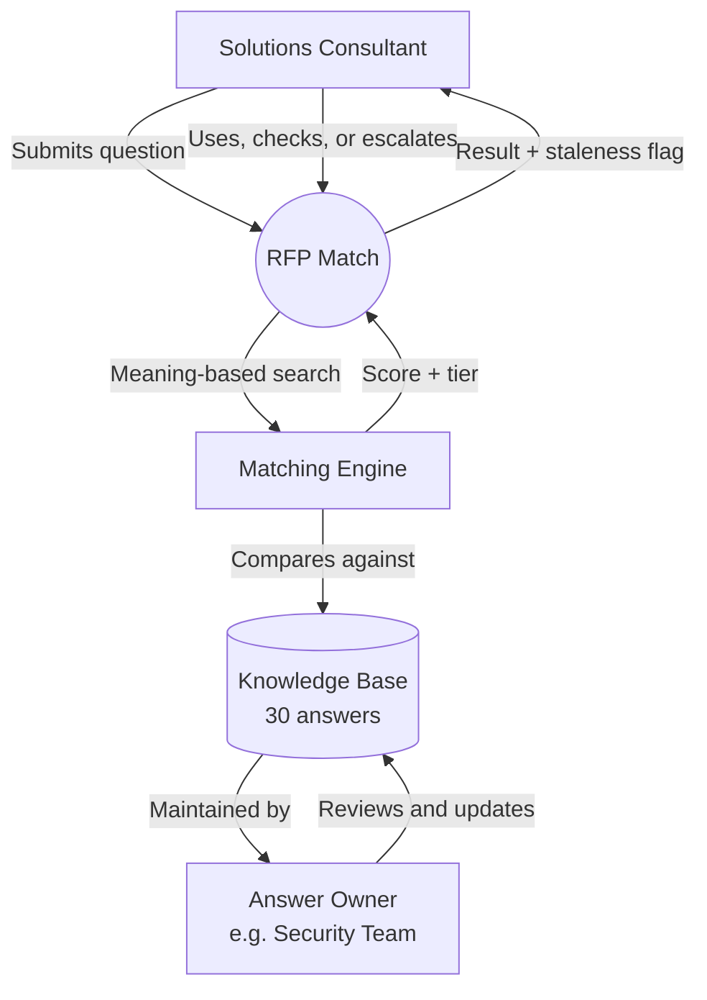
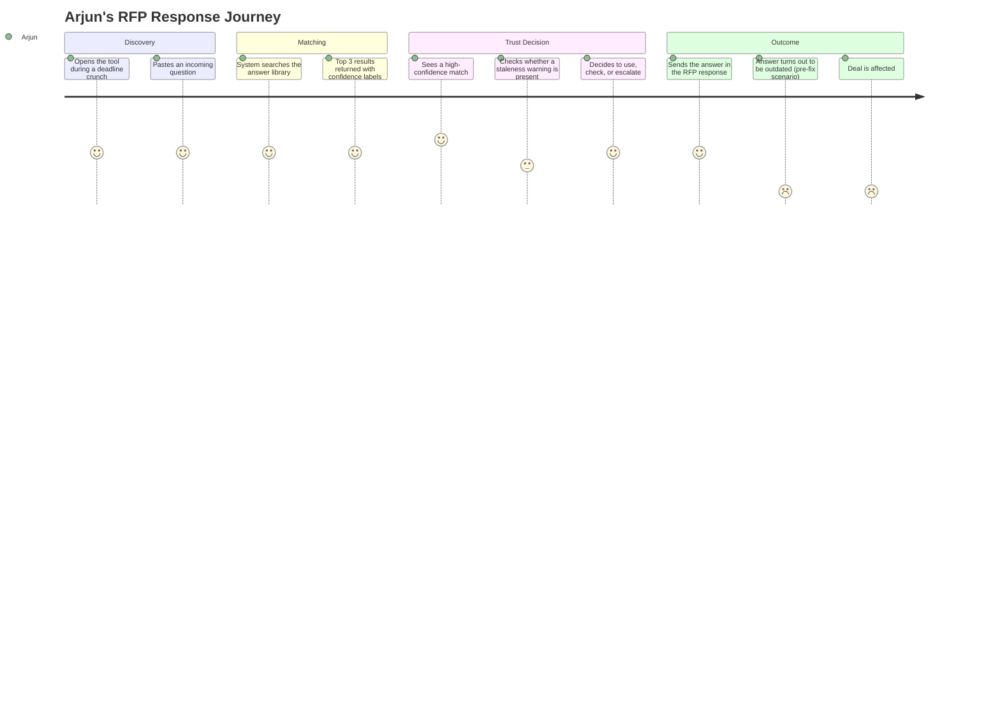
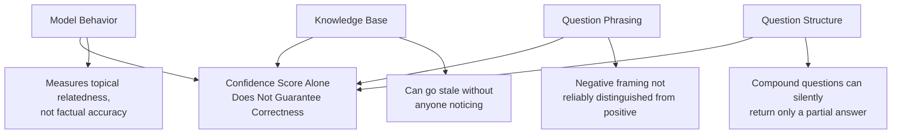
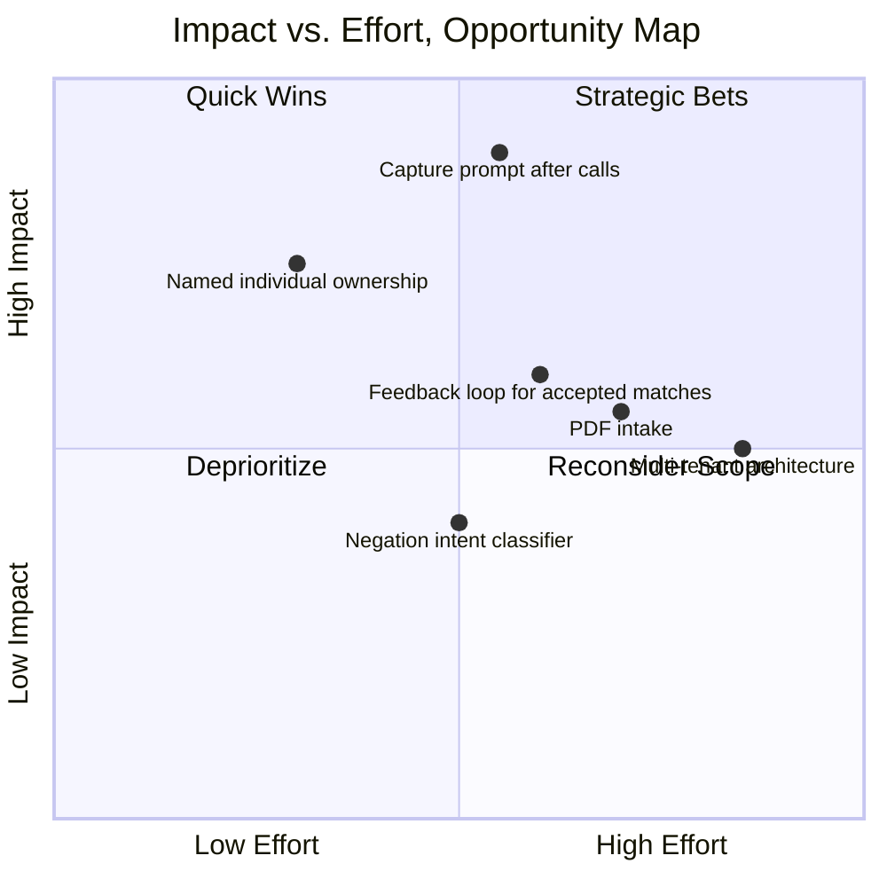
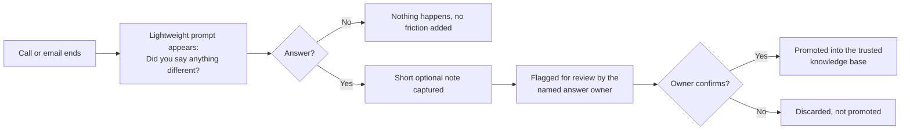
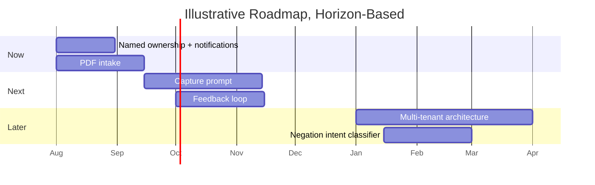

# RFP Match: Product Case Study 🎯

### AI-Powered Retrieval, Confidence Calibration, and Trust Design 🧠

 

---

> **A note on integrity:** Every figure in this document is either drawn from real testing conducted during this project (the eval suite, the score distributions, the calibration results) or sourced from public material (competitor facts, practitioner discussions, published research). Wherever a number or estimate could not be traced to either of those, it is explicitly labeled **`ASSUMPTION, Illustrative Estimate`** rather than presented as fact. This project was built as a proof of concept, not a monetized business.

---

## 📑 Table of Contents

1. [Executive Summary](#1-executive-summary)
2. [About This Project](#2-about-this-project)
3. [Product Ecosystem](#3-product-ecosystem)
4. [Problem Statement](#4-problem-statement)
5. [User Personas](#5-user-personas)
6. [User Journey Map](#6-user-journey-map)
7. [User Funnel](#7-user-funnel)
8. [North Star Metric](#8-north-star-metric)
9. [What Was Actually Measured](#9-what-was-actually-measured)
10. [Competitor Analysis](#10-competitor-analysis)
11. [SWOT Analysis](#11-swot-analysis)
12. [User Pain Points](#12-user-pain-points)
13. [Root Cause Analysis](#13-root-cause-analysis)
14. [Opportunity Mapping](#14-opportunity-mapping)
15. [Product Opportunities](#15-product-opportunities)
16. [Prioritization: RICE, MoSCoW, ICE](#16-prioritization-rice-moscow-ice)
17. [Feature Proposal: The Capture Prompt](#17-feature-proposal-the-capture-prompt)
18. [Product Requirements Document](#18-product-requirements-document)
19. [MVP Definition](#19-mvp-definition)
20. [Product Roadmap](#20-product-roadmap)
21. [Experimentation: Proposed Test Portfolio](#21-experimentation-proposed-test-portfolio)
22. [Analytics Dashboard](#22-analytics-dashboard)
23. [Risks](#23-risks)
24. [Future Vision](#24-future-vision)
25. [Key Takeaways](#25-key-takeaways)
26. [Broader Pattern](#26-broader-pattern)
27. [References](#27-references)

---

## 1. Executive Summary 🚀

RFP Match is a working proof of concept built for a fictional HR technology company called PeopleOS. It tests one specific idea: when a sales team answers a business proposal question, the real bottleneck is not writing new answers, it is finding answers that already exist and knowing whether to trust them.

**Why this problem matters:** Solutions Consultants at B2B software companies spend 15 to 25 hours per proposal cycle searching for answers their own company already wrote before. This is not a hypothetical. It is confirmed repeatedly across public discussions from people in this exact role.

**Why this case study matters to study:** Most AI retrieval prototypes stop at "does it find the right answer." This project went further and asked a harder question: when the system is wrong, does it at least know it might be wrong. That question led to the single most important finding in the entire project, that correct and incorrect answers can score in an overlapping range on a similarity scale, meaning no single confidence cutoff can perfectly separate them. The product decision that followed, choosing safety over convenience when a clean separation is not possible, is the core teaching moment of this case study.

> **Key context up front:** The system was validated with a 50-case labeled evaluation suite. Result: zero incorrect answers were ever shown as safe and automatic, across all 34 risk-category test cases. The cost of that safety: only 31.2 percent of genuinely correct answers landed in the automatic tier, the rest required a brief human check. This trade-off, choosing a lower automation rate to guarantee zero unsafe automatic answers, is the lens through which every decision in this document should be read.

---

## 2. About This Project 🏗️

### Project Overview

| Attribute | Detail |
|---|---|
| Built by | Sunidhi Mishra |
| Fictional company | PeopleOS, an HR technology SaaS company |
| Status | Working proof of concept, not production-ready |
| Live demo | rfpresponseassistant.web.app |
| Core stack | Python, FastAPI, Google Gemini embeddings, vanilla HTML/CSS/JS, Firebase Hosting, Render |
| Knowledge base | 30 pre-written answers across 6 categories |

### Core Components 🧩

| Component | What it does |
|---|---|
| **Matching Engine** | Compares an incoming question against 30 pre-written answers using meaning-based search |
| **Confidence Gate** | Assigns every result one of three tiers: safe to auto-use, needs a check, or escalate |
| **Staleness Signal** | An independent warning shown when an answer's review date has passed, regardless of match quality |
| **Eval Suite** | A repeatable, 50-case labeled test set that measures safety and accuracy separately by category |

---

## 3. Product Ecosystem 🌐

RFP Match is not a single two-party tool. It is a small coordination problem between the person who searches for answers, the person who owns and maintains those answers, and the AI layer that sits between them.

**Why this matters for prioritization:** the system's biggest unsolved problem, covered in Section 14, is that the arrow from the Answer Owner back into the Knowledge Base is currently passive. Nothing actively tells the owner when an answer needs attention. This single missing arrow is the root cause behind the entire staleness story in this case study.

---

## 4. Problem Statement 💭

### Primary User Problem

- **The bottleneck is retrieval, not writing.** A typical RFP has 50 to 150 questions. Most are recurring: security certifications, integrations, pricing, implementation timelines. Despite this repetition, answers live scattered across shared drives, old emails, and memory, with no reliable way to find them quickly.
- **Time cost is significant.** `ASSUMPTION, Illustrative Estimate` If a Solutions Consultant handles 35 RFPs per quarter with roughly 60 recurring questions each, at 15 to 25 minutes per question in search mode, that is roughly 700 hours per quarter spent searching for answers that already exist.
- **Accuracy risk is the hidden cost.** Different people retrieve different versions of the same answer. Some are outdated. Nobody has an easy way to know which version is current.

### Why Existing Tools Do Not Solve It

- Five established tools (Loopio, Responsive, Ombud, QorusDocs, Proposify) solve the basic storage problem. None of them show an honest confidence signal on their AI suggestions. A 95 percent match and a 60 percent match look identical on screen.
- None separate match quality from answer freshness. A highly similar match on a two-year-old answer looks exactly as safe as a similar match on something updated last week.

### The Hypothesis Being Tested

If verified answers are stored in a searchable library, an AI system that finds the right answer and is explicit about how confident it is in that match can meaningfully reduce search time without introducing unacceptable accuracy risk, as long as the system is honest about when it does not know the answer.

---

## 5. User Personas 👥

<b>💼 Arjun Mehta, The Solutions Consultant</b>

| Attribute | Detail |
|---|---|
| Role | Solutions Consultant, mid-market to enterprise B2B SaaS company |
| Experience | 3 to 6 years in the role |
| Owns | 60 to 80 percent of technical, security, and compliance questions across 25 to 40 RFPs per quarter |
| Discovery | An RFP question arrives nearly identical to one answered months earlier. Arjun finds a matching answer in the shared archive |
| Trust Step | He trusts it. The answer was correct when written, and nothing tells him otherwise. Under a five-day deadline, there is no time to independently re-verify |
| Breakdown | The company's data storage policy had changed six months earlier. Nobody updated the archive. It goes out as written. The deal falls apart |
| Behavioral Insight | A correct-looking answer with no freshness signal gets trusted exactly the same as a genuinely current one |
| Root Cause | Not an accuracy problem. A staleness-visibility problem |

<b>🛡️ Meera Iyer, The Security & Compliance Lead</b>

| Attribute | Detail |
|---|---|
| Role | Owns every security and compliance answer in the archive |
| Responsibility | Signs off on new entries when written, responsible for reviewing them before they go stale |
| Discovery | Meera reviewed and signed off on every security and compliance answer, confident they were accurate. Each was given a review date |
| Trust Step | She trusts an answer stays reliable once signed off, unless something actively tells her otherwise. Ownership means her name is attached. It does not mean anything notifies her |
| Breakdown | Two years pass. When the system was actually tested, every one of the 30 answers, including all of hers, had silently crossed its review deadline. Nothing had alerted her |
| Behavioral Insight | Ownership without an active trigger behaves exactly the same as no ownership at all |
| Root Cause | Not a discipline problem. A missing-trigger problem |

> **Note:** Arjun's scenario is grounded in real, sourced practitioner accounts from public pre-sales community discussions. Meera's scenario is grounded in a real incident that occurred during this project's own backend testing, not external research. 

---

## 6. User Journey Map

**Key insight:** the lowest point in the journey is not the search itself, that part works well. It is the moment of trust, when a confident-looking match is not actually accompanied by enough information to know if it is current. This directly shaped the decision to build an independent staleness signal, covered in Section 18 of the PRD.

---

## 7. User Funnel

| Stage | Description | Real, Sourced Number |
|---|---|---|
| RFP Arrives | A 94-question document lands with a 5-day deadline | Sourced from persona research |
| Answered from Memory | Questions Arjun can answer without searching | ~20 questions |
| Routed to Legal/Finance | Questions outside his ownership | ~15 questions |
| Requires Manual Search | The real bottleneck | ~60 questions, 15 to 25 hours total |
| System-Assisted Search (This Prototype) | Same 60 questions, run through RFP Match | 31.2% land in auto-answer tier, requiring only a quick check |

> `ASSUMPTION, Illustrative Estimate` The 20/15/60 split is sourced from persona research grounded in public practitioner discussion. The 31.2 percent auto-answer figure is a real, measured result from this project's own 50-case eval suite.

---

## 8. North Star Metric

> ## 🎯 North Star Metric
> ### **Time Saved per RFP Question, Without an Increase in Wrong Answers Sent**

**Why this metric, not a simpler one (like raw auto-answer rate):**

1. **It penalizes the exact failure mode this project is built to avoid.** A raw automation rate could rise while safety quietly falls, rewarding growth that poisons trust. Gating the metric on "without an increase in wrong answers" forces every future improvement to be tested against the safety bar already proven in this project's eval suite.
2. **It is testable today, unlike a live usage metric.** This prototype has no live users. The safety half of this metric is already measured. The time-saved half is the honest next step, requiring real usage data this project does not yet have.

### Supporting Metrics

| Metric | Category | Status |
|---|---|---|
| False-positive rate in the auto-answer tier | Safety | **Measured: 0.0% across 34 risk-category cases** |
| Auto-answer rate on true matches | Efficiency | **Measured: 31.2%** |
| Answer staleness rate | Trust | `ASSUMPTION` Production target, not yet measured live |
| Escalation rate trend over time | Coverage | `ASSUMPTION` Production target, not yet measured live |

---

## 9. What Was Actually Measured

Unlike a live product, this prototype has no real user funnel, no acquisition channel, and no retention data. This section states plainly what was and was not measured.

| Category | What Was Measured | What Was Not |
|---|---|---|
| Accuracy | 100% retrieval accuracy across 16 true-match test queries | Real-world accuracy across messy, unseen production questions |
| Safety | 0% false positives across 34 adversarial, unrelated, and ambiguous test cases (8 false-positive-risk + 5 unrelated + 10 multi-part + 11 negatively-framed) | Whether real users under real deadline pressure actually trust and act on the labels as designed |
| Calibration | The exact score overlap zone (0.77 to 0.81) between correct and incorrect matches | Whether a different embedding model would shrink that overlap |
| Known limitation | Negatively-framed questions correctly avoided the auto-answer tier in testing, but 2 of the 11 negatively-framed cases (a subset of the 34 risk-category cases above) missed their stricter expected tier | How often real RFPs actually contain negatively-framed questions |
 
> **Reconciling the two headline numbers:** 100% retrieval accuracy and 31.2% auto-answer rate are not in tension, they measure two different things. Retrieval accuracy asks whether the system found the *correct* answer at all, and it did, in every one of the 16 true-match cases. Auto-answer rate asks how many of those correct answers scored high enough to be shown *automatically without a human check*, which was true for only 5 of the 16. The system was never wrong about which answer was correct. It was simply, by design, cautious about which correct answers it was confident enough to show without review. Full breakdown across the whole suite: 16 true-match cases plus 34 risk-category cases (8 false-positive-risk, 5 unrelated, 10 multi-part, 11 negatively-framed, all subsets of the 34) equals 50 total cases.

---

## 10. Competitor Analysis

| Dimension | RFP Match (this prototype) | Loopio | Responsive | Ombud | QorusDocs | Proposify |
|---|---|---|---|---|---|---|
| Founded | This project | 2014 | 2015 | 2016 | 2012 | 2013 |
| Core focus | Confidence-calibrated retrieval | Content library and workflow | Content library and workflow | Broader revenue enablement | Proposal automation | Proposal building |
| Shows a confidence score | **Yes** | No | No | No | No | No |
| Separates match quality from answer freshness | **Yes** | No | No | No | No | No |
| Validated with a labeled eval suite | **Yes, 50 cases** | Not publicly disclosed | Not publicly disclosed | Not publicly disclosed | Not publicly disclosed | Not publicly disclosed |
| Multi-tenant, production-ready | No | Yes | Yes | Yes | Yes | Yes |

---

## 11. SWOT Analysis

| Strengths | Weaknesses |
|---|---|
| Confidence threshold set from real tested data, not intuition | Only tested against a small, clean, 30-entry knowledge base |
| 0% false positives across 34 adversarial test cases | No PDF intake, questions must be typed or pasted |
| Independent staleness signal, a real gap in the existing market | No feedback loop, does not learn from usage |
| Built and deployed end to end, live and publicly accessible | Solo build, no design or engineering team, short timeframe |

| Opportunities | Threats |
|---|---|
| The capture gap insight, connecting to real post-award research, is a genuinely original finding | A production version competing with funded incumbents faces real distribution disadvantage |
| The eval suite methodology is reusable for any future confidence-gated AI system | Embedding model changes would require full re-calibration, with no plan currently in place |

---

## 12. User Pain Points

| # | Pain Point | Affected Persona | Source |
|---|---|---|---|
| 1 | Answers scattered across a dozen documents with no official version | Arjun | Sourced from G2 and Glassdoor practitioner reviews |
| 2 | AI suggestion tools show a match with no confidence signal | Arjun | Sourced from pre-sales community discussion |
| 3 | An outdated answer sent confidently, deal lost as a result | Arjun | Sourced practitioner quote |
| 4 | Ownership exists on paper with no active trigger to act on it | Meera | Discovered directly during this project's own testing |

---

## 13. Root Cause Analysis

### 5 Whys, "Why did every answer in the knowledge base go stale without anyone noticing?"

1. **Why** did all 30 answers cross their review date unnoticed? → Because nobody actively checked review dates during the two-year window between when they were written and when they were tested.
2. **Why** did nobody check? → Because ownership was recorded as a team name on a record, not a person with an active responsibility to check.
3. **Why** does a team name not create action? → Because a team name receives no notification. Only a specific, named individual with an active trigger would.
4. **Why** was there no active trigger built in the first place? → Because the prototype was scoped to test retrieval and confidence scoring specifically, not the maintenance workflow around the knowledge base.
5. **Why** is that maintenance workflow still unsolved? → **Root cause:** it requires a genuinely different kind of feature, a lightweight, low-friction capture and review trigger, that was correctly identified as out of scope for this prototype but not yet built. This is a scoping gap, not an oversight.

### Fishbone Summary, "Why does the confidence score alone not guarantee a correct answer?"

---

## 14. Opportunity Mapping

**Quick Wins:** named individual ownership with active notifications, low effort relative to how directly it fixes the staleness root cause found in Section 14.
**Strategic Bets:** the capture prompt (Section 18), high impact, moderate to high effort, deserving of the full feature-proposal treatment.

---

## 15. Product Opportunities 💡

| # | Opportunity | Problem It Solves | Section Reference |
|---|---|---|---|
| 1 | Named individual ownership with active review notifications | Staleness going unnoticed | §14 |
| 2 | **Capture prompt after calls and emails** | The capture gap, informal commitments never reaching the archive | §18 |
| 3 | PDF intake and question extraction | Manual question extraction defeats time savings | Production Gap Analysis |
| 4 | Feedback loop from accepted or rejected matches | System does not improve from real usage | Production Gap Analysis |
| 5 | Negation-aware intent classifier | Negatively-framed questions not reliably distinguished | Confidence Threshold document |
| 6 | Multi-tenant architecture with data isolation | Cannot yet serve more than one company safely | Production Gap Analysis |

---

## 16. Prioritization: RICE, MoSCoW, ICE

> **Methodology note:** Scores below are illustrative PM-judgment estimates for prioritization practice, consistent with how this technique is used in real product teams. This prototype has no real backlog scoring history to draw from.

| # | Opportunity | RICE Score | MoSCoW | ICE Score | Priority |
|---|---|---|---|---|---|
| 1 | Named individual ownership + notifications | 320 | Must-have | 8.1 | **P0** |
| 2 | Capture prompt after calls and emails | 210 | Must-have (Strategic) | 7.6 | **P0 (strategic)** |
| 3 | PDF intake | 260 | Must-have | 6.9 | P0 |
| 4 | Feedback loop | 180 | Should-have | 6.4 | P1 |
| 5 | Negation-aware intent classifier | 95 | Could-have | 5.2 | P2 |
| 6 | Multi-tenant architecture | 140 | Should-have (for scale) | 6.0 | P1 |
 
**Why the Capture Prompt is P0 despite a modest RICE score:** RICE rewards near-term, well-scoped wins, and named ownership genuinely is one. The capture prompt is prioritized as a strategic bet anyway because it addresses the single deepest root cause identified across this entire project, that a retrieval system can only find what has actually been captured, and no amount of matching-algorithm improvement fixes that. Its MoSCoW label is marked Must-have (Strategic) rather than Should-have specifically to keep this table internally consistent with its P0 priority, this is a deliberate override, not an oversight, and it ships in the Next horizon rather than last, see Sections 20 and 21.

---

## 17. Feature Proposal: The Capture Prompt 🤖

### Problem

The knowledge base only reflects what someone formally wrote down. Real commitments made on sales calls, in emails, in meetings, never reach it. A retrieval system, no matter how good, can only find what has actually been captured.

### Solution

A lightweight prompt shown right after a natural end point, a call ending or an email being sent, asking one simple question: did you say anything that differs from the currently documented answer. A yes or no, with an optional short note if yes.

### User Flow

### Benefits

- **User:** Almost zero added effort, a single yes or no question at a moment that already exists in their workflow.
- **System:** Closes the single biggest gap identified across the entire project, without requiring a full editing workflow.
- **Answer Owner:** Receives specific, timely flags instead of having to remember to check everything on a schedule.

### Risks

- **Low response rate risk.** If the prompt feels like one more task, people may ignore it. Needs to be tied to something already happening, not an added chore.
- **Noise risk.** Without the owner review step, low-quality flags could pollute the trusted knowledge base. The review gate exists specifically to prevent this.

### Success Metrics (Proposed, Not Yet Measured)

| Metric | Target Signal |
|---|---|
| Prompt response rate | % of calls/emails where the prompt gets an answer |
| Flag-to-promotion rate | % of flagged items the owner confirms and promotes |
| Reduction in stale answers over time | Declining staleness rate after the feature ships |

---

## 18. Product Requirements Document

**Feature:** RFP Match (v1, this prototype)

| Section | Detail |
|---|---|
| **Objective** | Reduce RFP search time without introducing unacceptable accuracy risk, by making AI confidence explicit rather than hidden |
| **Problem** | Solutions Consultants spend 15 to 25 hours per RFP searching for answers that already exist, with no reliable way to know which version is current |
| **Goals** | Zero false positives in the auto-answer tier, a threshold set from real tested data, a working publicly accessible demo |
| **Acceptance Criteria** | Given a question with a genuine match above 0.85 similarity, the system labels it Auto-Answer. Given a question with no reliable match, the system labels it Escalate to SME, never Auto-Answer |
| **Scope (v1)** | Text-based question input only, single fictional company, 30-entry knowledge base, three-tier confidence system |
| **Out of Scope (v1)** | PDF intake, multi-tenant support, feedback loop, real enterprise security |
| **Dependencies** | Google Gemini embeddings API, Firebase Hosting, Render backend hosting |

Full detail available in the standalone PRD document.

---

## 19. MVP Definition

| Version | Scope |
|---|---|
| **V1 (This Prototype)** | Single fictional company, 30-entry knowledge base, three-tier confidence system, independent staleness signal, 50-case eval suite |
| **V2** | Named individual ownership with active notifications, PDF intake, capture prompt (§18), feedback loop from accepted/rejected matches |
| **V3** | Multi-tenant architecture, negation-aware intent classifier, real enterprise data security |

---

## 20. Product Roadmap

| Horizon | Initiative | Rationale |
|---|---|---|
| **Now** | Named individual ownership + active notifications | Directly fixes the staleness root cause found during this project's own testing |
| **Now** | PDF intake | Table stakes for real time savings in a real workflow |
| **Next** | Capture prompt (§18) | Highest strategic upside, addresses the deepest root cause in the whole project |
| **Next** | Feedback loop from accepted/rejected matches | Lets the system improve from real usage over time |
| **Later** | Multi-tenant architecture | Needed before this could serve more than one company safely |
| **Later** | Negation-aware intent classifier | Lower priority until real usage data shows how often negative framing actually occurs |

---

## 21. Experimentation: Proposed Test Portfolio

`ASSUMPTION` None of the following have been run. They are proposed as the honest next step, not presented as completed experiments.

| # | Hypothesis | Metric | Status |
|---|---|---|---|
| 1 | Named ownership with active notifications reduces staleness rate | Answer staleness rate over time | Not yet run |
| 2 | The capture prompt increases real capture rate without adding meaningful friction | Prompt response rate, time-to-complete | Not yet run |
| 3 | A secondary verification step recovers more true matches without reintroducing false positives | Auto-answer rate at constant 0% false-positive rate | Not yet run |

---

## 22. Analytics Dashboard

**Recommended dashboard for a production version:**

| Metric | Why it matters |
|---|---|
| False-positive rate in the auto-answer tier | The single most important safety metric, already proven at 0% in testing |
| Auto-answer rate on true matches | Currently measured at 31.2%, the efficiency side of the safety trade-off |
| Answer staleness rate | Would confirm whether named ownership actually reduces stale answers |
| Escalation rate trend | Declining suggests coverage improving, flat or rising suggests a capture gap |

---

## 23. Risks ⚠️

| Category | Risk |
|---|---|
| **Safety** | A wrong answer gets shown automatically with high confidence. Mitigated: threshold set from real tested data, validated at zero incidents across 34 adversarial cases |
| **Data quality** | The answer library becomes outdated and nobody notices. Mitigated: independent staleness signal, but active notification not yet built |
| **Trust** | Users stop trusting the system after one visible mistake. Not yet solved, would need a conservative launch strategy |
| **Technical** | The underlying AI model changes or is discontinued, invalidating the current calibration. Not yet addressed |
| **Real-world fit** | Real RFP questions are messier than the clean test set used here. Acknowledged directly, not yet tested against messy real-world data |

---

## 24. Future Vision

> **Speculative, PM-judgment scenario, not a roadmap commitment.**

A mature version of this system by a later stage plausibly evolves along three lines already visible in this teardown:

1. **From retrieval to capture-and-retrieval.** The capture prompt (§18) matures from a proposed feature into the system's actual foundation, closing the gap between what is documented and what has actually been promised.
2. **From a single confidence score to layered verification.** A secondary check, verifying not just topical similarity but whether an answer actually addresses a question's intent, recovers more of the 68.8 percent of true matches currently lost to the review tier, without reintroducing false-positive risk.
3. **From one company to a multi-tenant platform**, with the same safety-first calibration discipline proven here applied per-tenant, rather than rebuilt from scratch for each customer.

---

## 25. Key Takeaways 🔑

- This prototype's real contribution is not the retrieval mechanism, it is proof that a confidence threshold can be set from tested data instead of intuition, and that the resulting trade-off can be stated honestly rather than hidden.
- The single most important finding, that correct and incorrect answers can occupy an overlapping score range, is a structural property of similarity-based retrieval, not a flaw in this specific build.
- The capture gap, discovered through research and then confirmed through this project's own testing, is a stronger and more original insight than anything invented for the sake of looking thorough.

---

## 26. Broader Pattern

This project's own knowledge base going silently stale for two years is a small-scale version of a pattern documented at much larger scale in published research on post-contract obligation tracking, that fewer than 3 in 10 real-world changes are ever formally recorded anywhere, and that this is not a failure of individual discipline but a failure of system design. Retrieval systems built only on formally documented information will always be searching a partial picture of reality, unless a genuine capture mechanism exists alongside them. This pattern likely generalizes well beyond RFP response, to any workflow where a small library of "official" answers sits next to a much larger, informal, and undocumented reality.

---

## 27. References

> Public sources and this project's own testing only. Figures without a clear source are marked ASSUMPTION in the relevant section rather than cited here.

1. This project's own backend testing, threshold calibration results, and 50-case evaluation suite. Full detail in the Confidence Threshold and Evaluation Framework document.
2. Practitioner pain points sourced from publicly available reviews on G2 and Glassdoor, and discussions in online pre-sales and solutions engineering communities.
3. Competitor facts (Loopio, Responsive, Ombud, QorusDocs, Proposify) sourced from public company information and the Competitive Landscape document built for this project.
4. Post-contract obligation tracking research referenced in the Problem Research Document, drawn from publicly published practitioner research on enterprise contract management.
5. Live demo and full technical implementation: rfpresponseassistant.web.app.